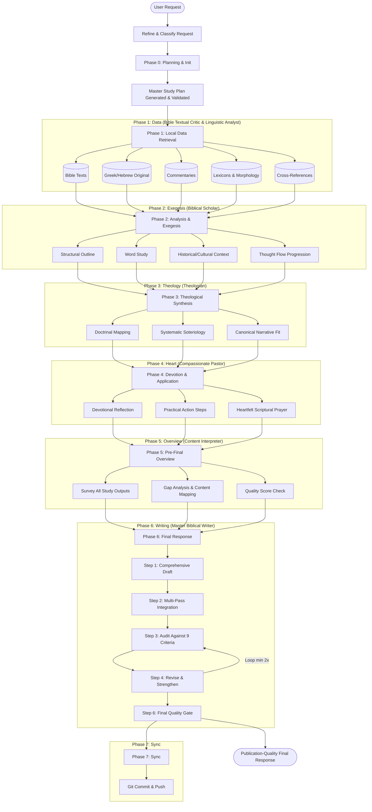

# Antigravity BibleMate Workspace

*An integrated local workspace combining robust scripture databases, modular study skills, and specialized AI personas to streamline biblical research and writing on the Google Antigravity platform.*

> [!NOTE]
> **Where Rigorous Scholarship Meets Agentic Power:** This repository unites the advanced agentic workflow capability of the **Google Antigravity Platform** with the reliable, time-tested databases of the **[UniqueBible Project](https://github.com/eliranwong/UniqueBible)** and the modular AI exegesis tools of **[BibleMate AI](https://github.com/eliranwong/biblemate)**.

Welcome to the **Antigravity BibleMate Workspace**, a state-of-the-art local agentic study suite configured specifically as an extension for the **Google Antigravity** development platform (compatible with the Antigravity CLI, IDE, and platform). It features an integrated team of 13 customized study personas, 115 standalone exegesis and theology skills, and 115 custom slash commands.

Whether you are a **pastor preparing a sermon**, a **bible content writer drafting articles**, a **theology student researching ancient manuscripts**, or a **believer deepening your study of the scriptures**, this workspace provides a unified, local-first environment where writing, AI agent assistance, and scholarly databases reside side-by-side in your IDE.

Official Antigravity downloads at: https://antigravity.google/download

---

## 🚀 The `/biblemate` Super-Skill: Orchestrated Bible Study

The `/biblemate` command (backed by the [.agents/skills/biblemate](.agents/skills/biblemate) orchestration suite) is the **super-skill** of this project. While individual slash commands perform specific exegesis tasks (like outline lookups or keyword analyses), `/biblemate` acts as a first-class Biblical scholar and orchestrator, running a fully automated, multi-phase research pipeline to produce publication-quality, deep-dive manuscripts.

### Why it is so powerful for Bible Study:
* **Phased Workflow**: It guides the AI assistant through 5 rigorous research phases—Planning, local database Data Retrieval, Analysis, Theological Synthesis, and pastoral/evangelistic Application.
* **Persona Rotation**: It automatically rotates AI personas based on the study phase (e.g., using the *Oxford Scholar* for exegesis, *Cambridge Theologian* for systematic theology, *Billy Graham* for devotions, and *Compassionate Pastor* for first-person prayers) to ensure academic rigor and spiritual depth.
* **100% Scripture Integrity**: It strictly enforces the local `bible` query skill to fetch all scriptures directly from SQLite databases, completely eliminating AI scripture hallucinations.
* **Quality Gate Auditing**: It validates the Master Plan against minimum skill requirements for the study type (passage, book, topical, or sermon) and computes a 0–100 quality score, ensuring no thin or shallow outputs are ever accepted.
* **Iterative Final Response**: After producing a pre-final overview that surveys all study outputs, it adopts the *Master Biblical Writer* persona and runs an iterative Draft→Integrate→Audit→Revise writing loop (minimum 2 cycles) to produce a comprehensive, standalone, publication-quality final response that directly answers the original request.

### `/biblemate` Workflow Architecture



---

## 🌟 Key Selling Points & Synergy

This project is the intersection of three powerful domains:

### 1. Reliable Databases (UniqueBible)
Unlike standard AI workflows that suffer from hallucinations when quoting, translating, or parsing scripture, this workspace relies directly on the SQLite database files developed and refined for over a decade in the **[UniqueBible project](https://github.com/eliranwong/UniqueBible)**. Bibles, commentaries, lexicons, morphology codes, and cross-references are queried locally at runtime, providing an unwavering, solid foundation of truth.

### 2. Intelligent Exegesis (BibleMate AI)
By integrating the tools and retrievers of **[BibleMate AI](https://github.com/eliranwong/biblemate)**, the agent team can dynamically locate words, compare translations, analyze Greek and Hebrew root words, extract commentaries, and track down cross-references instantly.

### 3. Integrated Developer Environment (Google Antigravity)
Leveraging the **Google Antigravity platform**, these tools are exposed natively in your developer environment:
* **Automatic Workspace Loading**: Simply open this workspace, and Antigravity will automatically load and register the entire team of agents, exegesis skills, and custom slash commands.
* **Inline Composition**: Write your study guides, sermons, or articles in the IDE while conversing with specialized agents in the side panel.
* **Slash Commands**: Execute complex workflows (e.g. `/sermon Romans 8:28` or `/translate-greek John 1:1`) with simple, parameterized commands.


---


## Directory Structure

All agentic configurations are self-contained under the `.agents/` folder at the root:

```
.agents/
├── agents.md             # Custom AI team personas and guidelines
├── skills/               # Standalone, modular exegesis and study skills
│   ├── outline/
│   ├── sermon/
│   ├── translate-greek/
│   └── ... (115 total skills)
└── workflows/            # Parameterized slash command workflows
    ├── outline.md
    ├── sermon.md
    └── ... (115 total slash commands)
```

---

## Quick Start & Auto-Discovery

Because this repository is already configured with the standard Antigravity workspace schema, the custom personas, skills, and workflows are **automatically discovered and registered locally** in your workspace when you open this project folder in your IDE.

1. **Open Workspace**: Open the workspace root directory in your Antigravity-integrated IDE (such as Cursor or VS Code configured with the Antigravity extension) or run the CLI inside this directory:
   ```bash
   agy
   ```
2. **Auto-Discovery**: Antigravity automatically detects the `.agents/` directory at the project root. It will:
   - Load the 13 custom personas from `agents.md` into the agent selection registry.
   - Register the 115 skills in `.agents/skills/` for progressive disclosure.
   - Expose the 115 workflow files in `.agents/workflows/` as native slash commands.

3. **Meet Prerequisites**: Ensure you meet all system and platform prerequisites listed in [System Prerequisites](#system-prerequisites).

4. **Running Slash Commands**: In the Antigravity chat input, type `/` to bring up the commands menu, followed by arguments (e.g. references, topics, or words):
   - `/outline Ephesians 1`
   - `/sermon Romans 8:28`
   - `/translate-greek John 1:1`

For a full reference of all available slash commands and usage examples, see the [Slash Commands Reference Guide](docs/slash_commands.md).

---

## System Prerequisites

To utilize the core capabilities of the local Bible study tools (such as database lookups and document exports), you must ensure the following dependencies are configured on your system:

1. **Local Bible Databases (`biblematedata`)**:  
   To enable local Scripture database lookups, you need to install the `biblematedata` package and initialize it:
   ```bash
   pip install --upgrade biblematedata
   biblematedata
   ```
   *Note: For more details on configuring database files, refer to the official [biblemate repository](https://github.com/eliranwong/biblemate).*

2. **Document Converter (`pandoc`)**:  
   To convert your study guides, outlines, and sermons into formats like Microsoft Word (`.docx`), ensure `pandoc` is installed on your system:
   - **macOS**: `brew install pandoc`
   - **Windows**: `winget install JohnMacFarlane.Pandoc` (or download the setup installer)
   - **Linux**: `sudo apt install pandoc` (or equivalent package manager command)

3. **Google Antigravity / AI Subscription**:  
   To run model inference for the agents and exegesis workflows, make sure you have set up your Google Antigravity account and configured your API key or model plan within the IDE (refer to the [Google Antigravity Documentation](https://antigravity.google/docs)).


---

## Setting Up a New Repository

If you wish to bring these custom Bible study agents and tools into a **different, brand-new repository** of your own, follow these steps:

1. **Copy Configuration & Preferences (Choose one method)**:
   - **Method A - Git users (Recommended)**: **Fork** this repository on GitHub and `git clone` it. This is highly recommended because when you write your own studies, generate exports, and run the `/sync` command, all changes will be synchronized cleanly to your own personal remote repository.
   - **Method B - Manual Copy (Zip File)**: Download [manual_setup.zip](https://github.com/eliranwong/antigravity-biblemate-workspace/raw/main/manual_setup.zip) into the root of your new project and extract it:
      * **Via Terminal (Recommended)**: Run the command for your operating system in your project root to download, extract, and clean up:
        * **macOS / Linux**:
          ```bash
          curl -L -O https://github.com/eliranwong/antigravity-biblemate-workspace/raw/main/manual_setup.zip && unzip manual_setup.zip && rm manual_setup.zip
          ```
        * **Windows (PowerShell)**:
          ```powershell
          Invoke-WebRequest -Uri "https://github.com/eliranwong/antigravity-biblemate-workspace/raw/main/manual_setup.zip" -OutFile "manual_setup.zip"; Expand-Archive -Path "manual_setup.zip" -DestinationPath "." -Force; Remove-Item -Path "manual_setup.zip"
          ```
        * **Windows (Command Prompt)**:
          ```cmd
          curl.exe -L -O https://github.com/eliranwong/antigravity-biblemate-workspace/raw/main/manual_setup.zip && tar -xf manual_setup.zip && del manual_setup.zip
          ```
      * **Via GUI (Double-Click)**: If you extract using double-click on macOS, the OS will wrap the contents in a `manual_setup` folder. Simply move the `.agents/` and `preferences/` folders out of it and into your project root.
      *(You can generate or regenerate this zip file at any time by running the `/zip` command).*
   - **Method C - Manual Copy (Folders)**: Manually copy the `.agents/` and `preferences/` folders from the root of this repository into the root of your new project. Google Antigravity will automatically discover the custom personas, skills, and workflows, while the `preferences/` folder preserves your default database preferences.

2. **Install System Prerequisites**: Ensure you have configured the [System Prerequisites](#system-prerequisites) on your system.

---

## Preferences & Customization

You can easily configure your preferred default versions for Bible translation, commentary, and lexicon lookups without modifying any code. To do this, edit the plain text files under the `preferences/` folder at the root of the repository:

- **Bible Default Version**: Set your preference (e.g. `NET`, `KJV`, `BSB`) in [preferences/bible.md](preferences/bible.md).
- **Commentary Default Version**: Set your preference (e.g. `AIC`, `BI`, `BARNES`) in [preferences/commentary.md](preferences/commentary.md).
- **Lexicon Default Version**: Set your preference (e.g. `SECE`, `BDB`, `Thayer`) in [preferences/lexicon.md](preferences/lexicon.md).

These files are dynamically read by the respective retrievers on every execution.

---

## Documentation

For in-depth details about the workflows, slash commands, and team structure, please refer to the files under the [docs/](docs) directory:

- **[ai_team_personas.md](docs/ai_team_personas.md)**: Detailed profiles, guidelines, and expertise profiles for each of the 10 custom AI study personas.
- **[slash_commands.md](docs/slash_commands.md)**: A complete reference guide for all 114 custom slash commands (workflows), organized by study category with syntax examples.
- **[README.md (Documentation Index)](docs/README.md)**: Index and overview of repository documentation.

