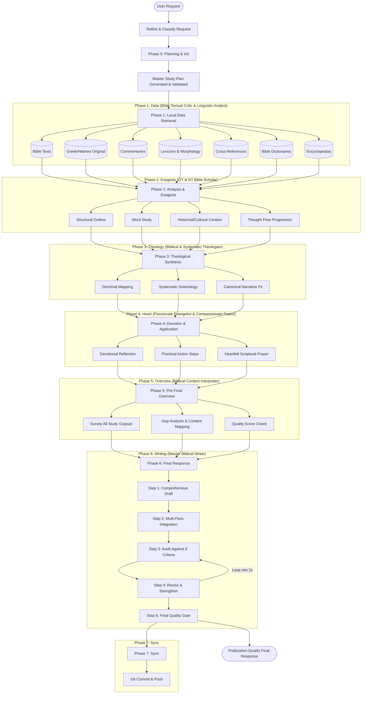

# Antigravity BibleMate Workspace

*An integrated local workspace combining robust scripture databases, modular study skills, and specialized AI personas to streamline biblical research and writing on the Google Antigravity platform.*

> [!NOTE]
> **Where Rigorous Scholarship Meets Agentic Power:** This repository unites the advanced agentic workflow capability of the **Google Antigravity Platform** with the reliable, time-tested databases of the **[UniqueBible Project](https://github.com/eliranwong/UniqueBible)** and the modular AI exegesis tools of **[BibleMate AI](https://github.com/eliranwong/biblemate)**.

Welcome to the **Antigravity BibleMate Workspace**, a state-of-the-art local agentic study suite configured as an extension for the **Google Antigravity** development platform (compatible with the Antigravity CLI, IDE, and platform). It features an integrated team of 15 customized study personas, 124 standalone exegesis and theology skills, and 124 custom slash commands.

> [!TIP]
> **Optional bonus for Claude Code users.** Beyond the primary Google Antigravity
> experience, this workspace *also* ships a parallel, self-contained **Claude Code**
> ecosystem under `.claude/` — the same 15 personas, 124 skills, and 124 slash
> commands, generated from `.agents/`. It is a completely **optional add-on**: you
> can ignore `.claude/` entirely and use the workspace purely on Antigravity, or use
> **either** platform **or** **both** interchangeably against a single shared
> workspace and shared local Bible databases. See
> [Claude Code Equivalent Ecosystem (Optional Bonus)](#-claude-code-equivalent-ecosystem-optional-bonus) below.

Whether you are a **pastor preparing a sermon**, a **bible content writer drafting articles**, a **theology student researching ancient manuscripts**, or a **believer deepening your study of the scriptures**, this workspace provides a unified, local-first environment where writing, AI agent assistance, and scholarly databases reside side-by-side in your IDE.

Official Antigravity downloads at: https://antigravity.google/download

---

## 🌟 Key Selling Points & Synergy

This project is the intersection of three powerful domains:

### 1. Reliable Databases (UniqueBible)
Unlike standard AI workflows that suffer from hallucinations when quoting, translating, or parsing scripture, this workspace relies directly on the SQLite database files developed and refined for over a decade in the **[UniqueBible project](https://github.com/eliranwong/UniqueBible)**. Bibles, commentaries, lexicons, morphology codes, and cross-references are queried locally at runtime, providing an unwavering, solid foundation of truth.

### 2. Intelligent Exegesis (BibleMate AI)
By integrating the tools and retrievers of **[BibleMate AI](https://github.com/eliranwong/biblemate)**, the agent team can dynamically locate words, compare translations, analyze Greek and Hebrew root words, extract commentaries, and track down cross-references instantly.

### 3. Integrated Developer Environment (Google Antigravity)
Leveraging the **Google Antigravity platform**, these tools are exposed natively in your developer environment:
* **Automatic Workspace Loading**: Simply open this workspace, and Antigravity will automatically load and register the entire team of agents, exegesis skills, and custom slash commands.
* **Inline Composition**: Write your study guides, sermons, or articles in the IDE while conversing with specialized agents in the side panel.
* **Slash Commands**: Execute complex workflows (e.g. `/sermon Romans 8:28` or `/translate-greek John 1:1`) with simple, parameterized commands.

---

## 🚀 The `/biblemate` Signature Command: Orchestrated Bible Study

The `/biblemate` command (backed by the [.agents/skills/biblemate](.agents/skills/biblemate) orchestration suite) is the **signature command** of this project. While individual slash commands perform specific exegesis tasks (like outline lookups or keyword analyses), `/biblemate` acts as a first-class Biblical scholar and orchestrator, running a fully automated, multi-phase research pipeline to produce publication-quality, deep-dive manuscripts.

### Why it is so powerful for Bible Study:
* **Phased Workflow**: It guides the AI assistant through 5 rigorous research phases—Planning, local database Data Retrieval, Analysis, Theological Synthesis, and pastoral/evangelistic Application.
* **Persona Rotation**: It automatically rotates AI personas based on the study phase (e.g., using the *OT Bible Scholar* / *NT Bible Scholar* for exegesis, *Biblical Theologian* / *Systematic Theologian* for theology, *Passionate Evangelist* for devotions, and *Compassionate Pastor* for first-person prayers) to ensure academic rigor and spiritual depth.
* **100% Scripture Integrity**: It strictly enforces the local `bible` query skill to fetch all scriptures directly from SQLite databases, completely eliminating AI scripture hallucinations.
* **Quality Gate Auditing**: It validates the Master Plan against minimum skill requirements for the study type (passage, book, topical, or sermon) and computes a 0–100 quality score, ensuring no thin or shallow outputs are ever accepted.
* **Iterative Final Response**: After producing a pre-final overview that surveys all study outputs, it adopts the *Master Biblical Writer* persona and runs an iterative Draft→Integrate→Audit→Revise writing loop (minimum 2 cycles) to produce a comprehensive, standalone, publication-quality final response that directly answers the original request.

### `/biblemate` Workflow Architecture



---

## ⚡ The `/biblemate-super` Ultimate Command: Dynamic & Goal-Oriented Research & Orchestration

The `/biblemate-super` command (backed by the [.agents/skills/biblemate-super](.agents/skills/biblemate-super) orchestration suite) is the **advanced, adaptive counterpart** to the standard `/biblemate` command. 

While `/biblemate` follows a preset, structured 6-phase framework, `/biblemate-super` is designed for complex, non-standard, or highly specific research tasks that require dynamic planning, custom tools, and strict validation checks.

### Key Differences & Enhancements:
* 🗺️ **Dynamic Phased Planning**: It does not force a generic template. The agent assesses the request and designs a custom-tailored multi-phase master plan containing custom phases specifically aligned to your objectives.
* 🎭 **Dynamic Persona Rotation**: Personas are matched to steps based on the specific task (e.g. using `Context Analyst David` for historical Psalms exegesis, `Linguistic Analyst` for original syntax, or `Bible Textual Critic` for translation variants), rather than following a rigid phase-locked rotation.
* 🎯 **Goal-Oriented Phase Audits**: Every custom phase is initialized with **Clear Phase Goals**. Upon completion of a phase, the **Study Plan & Phase Quality Auditor** persona runs a strict checkpoint review. If goals are not met, the auditor:
  1. Identifies textual, theological, or practical gaps.
  2. Prescribes and inserts new follow-up steps (e.g. running the `online` skill to fetch commentary, or doing extra lexically parsed lookups).
  3. Updates the plan and runs those steps, re-auditing until goals are satisfied before advancing.
* 🔍 **Flexible Plan Validation**: Validation checks verify that the dynamic plan contains a structured checklist with essential categories covered (Scripture Retrieval, Exegesis, Theology, and Application) rather than enforcing rigid tool inventories.

---

## Directory Structure

All agentic configurations are self-contained under the `.agents/` folder (for the Antigravity platform), with an **optional, parallel Claude Code** ecosystem under `.claude/` (see [below](#-claude-code-equivalent-ecosystem-optional-bonus)), while generated study outputs are written directly to your shared workspace:

```
├── .agents/              # Antigravity agentic config (personas, skills, workflows)
│   ├── agents.md         # Custom AI team personas and guidelines
│   ├── skills/           # Standalone, modular exegesis and study skills
│   └── workflows/        # Parameterized slash command workflows
├── .claude/              # Claude Code equivalent ecosystem (self-contained, portable)
│   ├── build_claude.py   # Regenerates .claude/ from .agents/ + preferences/
│   ├── settings.json     # Permissions + env (BIBLEMATE_DATA) for Claude Code
│   ├── agents.md         # Combined persona reference (paths ported to .claude)
│   ├── preferences/      # Default bible/commentary/lexicon version files
│   ├── skills/           # 124 Claude Code Agent Skills (one per .agents/skills/)
│   ├── commands/         # 124 slash commands (one per .agents/workflows/)
│   └── agents/           # 15 subagents (one per persona in agents.md)
├── preferences/          # Shared default version preferences (bible/commentary/lexicon)
├── biblemate/            # Saved study outputs, sermons, outlines, and devotions
├── images/               # Generated biblical illustrations and visual aids
├── notes/                # User-created notes, subfolders, and documents
└── export/               # Exported Word documents (.docx) and bundles
```

For in-depth details on file management and study output locations, see the **[Study Outputs Reference Guide](docs/study_outputs.md)**.


---

## 🤖 Claude Code Equivalent Ecosystem (Optional Bonus)

> [!NOTE]
> This section is **entirely optional**. The Google Antigravity integration under
> `.agents/` is the primary experience and requires nothing from `.claude/`. The
> Claude Code ecosystem below is an **additional choice** provided as a bonus for
> users who prefer to run BibleMate through [Claude Code](https://claude.com/claude-code)
> instead of — or alongside — Antigravity. If you do not use Claude Code, you can
> safely ignore everything in `.claude/`.

In addition to the native Google Antigravity integration, this workspace ships an
**optional, parallel, self-contained BibleMate ecosystem for [Claude Code](https://claude.com/claude-code)**
under `.claude/`. It is generated directly from `.agents/` + `preferences/`, so
it mirrors the Antigravity ecosystem one-to-one: the same **15 personas**, the same
**124 skills**, and the same **124 slash commands**, all using **relative paths**
only (no hardcoded absolute paths), so the workspace stays portable.

### One workspace, two ecosystems

The Antigravity (`.agents/`) and Claude Code (`.claude/`) ecosystems **coexist**
in a single repository and share the same local Bible databases, the same
`preferences/` defaults, and the same `biblemate/` study output directory. You
can use **either** platform or **both** interchangeably:

| | Antigravity | Claude Code |
| :-- | :-- | :-- |
| Config dir | `.agents/` | `.claude/` |
| Personas | `agents.md` (single file) | `.claude/agents/<slug>.md` (subagents) + `.claude/agents.md` |
| Skills | `.agents/skills/<name>/SKILL.md` | `.claude/skills/<name>/SKILL.md` |
| Slash commands | `.agents/workflows/<name>.md` | `.claude/commands/<name>.md` |
| Runtime data | `~/biblemate/data` (or `BIBLEMATE_DATA`) | `~/biblemate/data` (or `BIBLEMATE_DATA`) |
| Study outputs | `biblemate/` | `biblemate/` |

Because both read from the same SQLite databases and write to the same
`biblemate/` folder, a study started on one platform can be continued or
re-opened on the other.

### Using BibleMate with Claude Code

1. **Install Claude Code** if you have not already (CLI, desktop app, or IDE
   extension). The `.claude/` ecosystem is auto-discovered when you open this
   workspace as your project root.
2. **Install the shared database** (one-off, same as Antigravity):
   ```bash
   pip install --upgrade biblematedata
   biblematedata
   ```
3. **Run any slash command** exactly as you would on Antigravity — Claude Code
   registers the same names: `/bible`, `/sermon`, `/devotion`, `/biblemate`,
   `/biblemate-super`, `/translate-greek`, `/Gen` (book search), `/data`,
   `/sync`, etc. For example:
   ```
   /bible NET John 3:16
   /sermon Romans 8:28
   /translate-greek John 1:1
   ```
4. **Scripture integrity & output saving** are enforced the same way as on
   Antigravity: skills fetch every verse from the local SQLite databases via
   `python3 .claude/skills/bible/bible_retriever.py "..."` (never from memory),
   and study outputs are saved to `biblemate/` with a `YYYY-MM-DD-HH-MM-SS_`
   timestamp prefix.

### Portability (no absolute paths)

The `.claude/` ecosystem is fully self-contained and portable:

- All skill scripts and their bundled data files are **copied inside
  `.claude/skills/`** — the skills and commands do not depend on any files
  outside the `.claude/` directory.
- Runtime Bible data resolves in this order:
  1. the `BIBLEMATE_DATA` environment variable (point it anywhere), else
  2. `~/biblemate` (the standard install location).
  Override it in [`.claude/settings.json`](.claude/settings.json) (`env.BIBLEMATE_DATA`)
  if your data lives elsewhere.
- Default bible/commentary/lexicon versions are read from
  [`.claude/preferences/`](.claude/preferences), a copy of the shared
  [`preferences/`](preferences) folder.

### Regenerating or refreshing `.claude/`

The Claude Code ecosystem is produced by a generator script. Re-run it after
editing `.agents/` or `preferences/` to keep `.claude/` in sync (idempotent;
only rewrites `skills/`, `commands/`, `agents/`, `preferences/`, and `agents.md`
under `.claude/`):

```bash
python3 .claude/build_claude.py
```

From within Claude Code you can also run the tailored `/update` command, which
refreshes the bundled `.agents/` + `preferences/` source from the remote
`manual_setup.zip` and then regenerates `.claude/`.


---

## 🌐 Standalone Web Application

In addition to the native Antigravity IDE integration, this workspace ships with a **self-contained browser-based web application** ([`web_app.py`](web_app.py)) built with [NiceGUI](https://nicegui.io). It lets you run the full suite of BibleMate AI agents, monitor live execution, browse generated study reports, and view AI-generated biblical images — all from any modern web browser on your local machine.


### Key Features

- **Chat Workspace** — submit study requests and receive beautifully rendered Markdown responses streamed in real time
- **Live Agent Console** — watch the agent's thinking monologue, active tool calls, and system logs as they happen
- **Stop Button** — cancel any running agent mid-execution with one click
- **File Tree & Document Reader** — browse and open saved Markdown study outputs, notes, and AI-generated images directly in the browser
- **Inline Markdown Editor** — edit any deletable markdown study outputs or notes right from the web browser with Save/Cancel capability
- **Notes Management** — select the `notes` directory to add files and subfolders on demand, with empty folders displaying instantly in the tree
- **Image Generation (`/image`)** — generate Bible-related images on demand; files are saved to `images/` with a timestamped filename
- **Settings Drawer** — switch AI models (Gemini 3.5 Flash/Pro, 2.0 Flash, 1.5 Pro/Flash), select a persona, or enforce a specific skill
- **Dark / Light Mode** — fully themeable UI


### Quick Launch

```bash
pip install biblematedata google-antigravity nicegui Pillow
biblematedata
python3 web_app.py
```

Then open **[http://localhost:33377](http://localhost:33377)** in your browser.

> **Full setup guide:** [`docs/standalone_web_app.md`](docs/standalone_web_app.md)

---

## Quick Start for a Local Workspace

Prerequisites: Install the database (one-off operation):

```bash
pip install biblematedata
biblematedata
```

Download the agents and setup the workspace folder:

```bash
# Navigate to your workspace directory
cd <workspace_directory_name>
# Download and import into your workspace directory
curl -L -O https://github.com/eliranwong/antigravity-biblemate-workspace/raw/main/manual_setup.zip && tar -xf manual_setup.zip && rm manual_setup.zip && mkdir -p biblemate notes images export
```

Launch Antigravity, for example:

```bash
antigravity-ide # or 'antigravity' (GUI without text editor) or agy (Antigravity CLI)
```

## Auto-Discovery

Because this repository is already configured with the standard Antigravity workspace schema, the custom personas, skills, and workflows are **automatically discovered and registered locally** in your workspace when you open this project folder in your IDE.

1. **Open Workspace**: Open the workspace root directory in your Antigravity-integrated IDE (such as Cursor or VS Code configured with the Antigravity extension) or run the CLI inside this directory:
   ```bash
   agy
   ```
2. **Auto-Discovery**: Antigravity automatically detects the `.agents/` directory at the project root. It will:
   - Load the 15 custom personas from `agents.md` into the agent selection registry.
   - Register the 121 skills in `.agents/skills/` for progressive disclosure.
   - Expose the 121 workflow files in `.agents/workflows/` as native slash commands.

3. **Meet Prerequisites**: Ensure you meet all system and platform prerequisites listed in [System Prerequisites](#system-prerequisites)

4. **Running Slash Commands**: In the Antigravity chat input, type `/` to bring up the commands menu, followed by arguments (e.g. references, topics, or words):
   - `/outline Ephesians 1`
   - `/sermon Romans 8:28`
   - `/translate-greek John 1:1`

For a full reference of all available slash commands and usage examples, see the [Slash Commands Reference Guide](docs/slash_commands.md).

---

## System Prerequisites

To utilize the core capabilities of the local Bible study tools (such as database lookups and document exports), you must ensure the following dependencies are configured on your system:

1. **Local Bible Databases (`biblematedata`)**:  
   To enable local Scripture database lookups, you need to install the `biblematedata` package and initialize it:
   ```bash
   pip install --upgrade biblematedata
   biblematedata
   ```
   *Note: For more details on configuring database files, refer to the official [biblemate repository](https://github.com/eliranwong/biblemate).*

2. **Document Converter (`pandoc`)**:  
   To convert your study guides, outlines, and sermons into formats like Microsoft Word (`.docx`), ensure `pandoc` is installed on your system:
   - **macOS**: `brew install pandoc`
   - **Windows**: `winget install JohnMacFarlane.Pandoc` (or download the setup installer)
   - **Linux**: `sudo apt install pandoc` (or equivalent package manager command)

3. **Google Antigravity / AI Subscription**:  
   To run model inference for the agents and exegesis workflows, make sure you have set up your Google Antigravity account and configured your API key or model plan within the IDE (refer to the [Google Antigravity Documentation](https://antigravity.google/docs)).


---

## Setting Up a New Repository

If you wish to bring these custom Bible study agents and tools into a **different, brand-new repository** of your own, follow these steps:

1. **Copy Configuration & Preferences (Choose one method)**:
   - **Method A - Git users (Recommended for developers)**: **Fork** this repository on GitHub and `git clone` it. This is highly recommended because when you write your own studies, generate exports, and run the `/sync` command, all changes will be synchronized cleanly to your own personal remote repository.
   - **Method B - Download (Zip File)**: Download [manual_setup.zip](https://github.com/eliranwong/antigravity-biblemate-workspace/raw/main/manual_setup.zip) into the root of your new project and extract it:
      * **Via Terminal (Recommended)**: Run the command for your operating system in your project root to download, extract, and clean up:
        * **macOS / Linux**:
          ```bash
          curl -L -O https://github.com/eliranwong/antigravity-biblemate-workspace/raw/main/manual_setup.zip && tar -xf manual_setup.zip && rm manual_setup.zip && mkdir -p biblemate notes images export
          ```
        * **Windows (PowerShell)**:
          ```powershell
          Invoke-WebRequest -Uri "https://github.com/eliranwong/antigravity-biblemate-workspace/raw/main/manual_setup.zip" -OutFile "manual_setup.zip"; Expand-Archive -Path "manual_setup.zip" -DestinationPath "." -Force; Remove-Item -Path "manual_setup.zip"; New-Item -ItemType Directory -Path "biblemate","notes","images","export" -Force
          ```
        * **Windows (Command Prompt)**:
          ```cmd
          curl.exe -L -O https://github.com/eliranwong/antigravity-biblemate-workspace/raw/main/manual_setup.zip && tar -xf manual_setup.zip && del manual_setup.zip && md biblemate notes images export
          ```
      * **Via GUI (Double-Click)**: If you extract using double-click on macOS, the OS will wrap the contents in a `manual_setup` folder. Simply move the `.agents/`, `preferences/`, and `.claude/` folders out of it and into your project root.
      *(You can generate or regenerate this zip file at any time by running the `/zip` command).*
   - **Method C - Manual Copy (Folders)**: Manually copy the `.agents/`, `preferences/`, and `.claude/` folders from the root of this repository into the root of your new project. Google Antigravity will automatically discover the custom personas, skills, and workflows, while the `preferences/` folder preserves your default database preferences, and `.claude/` preserves your Claude Code configs.

2. **Install System Prerequisites**: Ensure you have configured the [System Prerequisites](#system-prerequisites) on your system.

### How to Update
To update your workspace with the latest agent configurations, skills, and command definitions:
* **For Git users (Method A)**: Simply run `git pull` in your terminal to fetch and merge the latest updates from the upstream repository.
* **For Manual users (Method B or C)**:
  * **Via Slash Command (macOS/Linux only)**: Run the `/update` command in the chat interface. This automatically downloads the latest `manual_setup.zip`, extracts it, and creates required workspace directories.
  * **Via Terminal**: Simply redo the manual download (downloading and extracting the fresh `manual_setup.zip`) or re-copy the `.agents/`, `preferences/`, and `.claude/` directories into your repository root, overwriting the existing folders.

---

## Preferences & Customization

You can easily configure your preferred default versions for Bible translation, commentary, and lexicon lookups without modifying any code. To do this, edit the plain text files under the `preferences/` folder at the root of the repository:

- **Bible Default Version**: Set your preference (e.g. `NET`, `KJV`, `BSB`) in [preferences/bible.md](preferences/bible.md).
- **Commentary Default Version**: Set your preference (e.g. `AIC`, `BI`, `BARNES`) in [preferences/commentary.md](preferences/commentary.md).
- **Lexicon Default Version**: Set your preference (e.g. `SECE`, `BDB`, `Thayer`) in [preferences/lexicon.md](preferences/lexicon.md).

These files are dynamically read by the respective retrievers on every execution.

---

## Documentation

For in-depth details about the web app, workflows, slash commands, and team structure, please refer to the files under the [docs/](docs) directory:

- **[standalone_web_app.md](docs/standalone_web_app.md)**: Complete setup and usage guide for the standalone NiceGUI web application (`web_app.py`), including installation, slash commands, image generation, settings, and troubleshooting.
- **[ai_team_personas.md](docs/ai_team_personas.md)**: Detailed profiles, guidelines, and expertise profiles for each of the 15 custom AI study personas.
- **[slash_commands.md](docs/slash_commands.md)**: A complete reference guide for all 120 custom slash commands (workflows), organized by study category with syntax examples.
- **[study_outputs.md](docs/study_outputs.md)**: A guide explaining where and how study outputs, images, and Word exports are saved within your workspace.
- **[README.md (Documentation Index)](docs/README.md)**: Index and overview of repository documentation.

