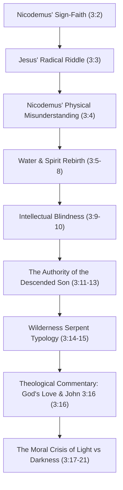

# Step 016: Thought Progression and Dialogue Flow in John 3:1-21
**Persona**: Oxford Bible Scholar
**Passage**: John 3:1-21

The discourse in John 3:1-21 displays a masterfully structured transition from dialogue to monologue, moving from physical assumptions to spiritual revelations.

### Flow Analysis

#### 1. Outward Sincerity to Inward Revolution (3:1-3)
Nicodemus begins by trying to establish common ground. He speaks on behalf of his peers ("we know you are a teacher..."). He keeps Jesus at the level of a godly reformer. Jesus ignores the pleasantries and immediately issues a cosmic veto. To look at signs from the outside is useless; unless there is a complete spiritual renovation from above (*anothen*), one remains blind to God's Kingdom.

#### 2. Socratic Deconstructive Dialogue (3:4-10)
Nicodemus represents logical humanism. He pushes Jesus' riddle into absurdity: must an old man physically shrink and crawl back into the womb? Jesus guides him from biological limits to Pneumatological realities. He references "water and Spirit"—symbols of eschatological washing and cleansing from the Old Prophets. The flesh can only propagate its own broken condition. The Holy Spirit is like the wind—invisible, sovereign, self-moving, yet undeniably real in its life-giving effects. When Nicodemus persists in his incomprehension, Jesus strips him of his spiritual credentials: how can the recognized "Teacher of Israel" be ignorant of these foundational prophetic concepts?

#### 3. Christic Monologue and Authority (3:11-13)
The dialogue shifts. Nicodemus falls silent; he does not speak again in this passage. Jesus assumes a sovereign voice. He points to His exclusive credentials. No human can ascend to heaven to grab divine truth; but He, the Son of Man, is the descended One from heaven. He has immediate, direct access to heavenly mysteries.

#### 4. The Cross and Old Testament Fulfillment (3:14-15)
To explain how this rebirth can physically happen for a dying world, Jesus cites Numbers 21. When the Israelites rebelled and were bitten by lethal vipers, God did not remove the vipers; He provided a cure. A bronze serpent was lifted on a pole. Those who looked with trust lived. Similarly, the Son of Man must be lifted up (*hypsōthēnai*) on the cross and in glory. Looking to the crucified One is the source of eternal life.

#### 5. The Ultimate Revelation of God's Heart (3:16-21)
At this point, the text transitions into John the Evangelist’s theological meditation (or a continuation of Jesus' monologue). The flow moves from the *mechanism* of salvation (the lifted Son in 3:14-15) to the *origin* of salvation (the loving Father in 3:16). God so loved the *kosmos* that He delivered He irreplaceable Son. The final lines explain that judgment is not a arbitrary bolt of lighting from heaven; it is the natural consequence of human choice. When the Light comes, those who cling to sin run to the darkness, while those whom the Spirit has changed step gladly into the light.