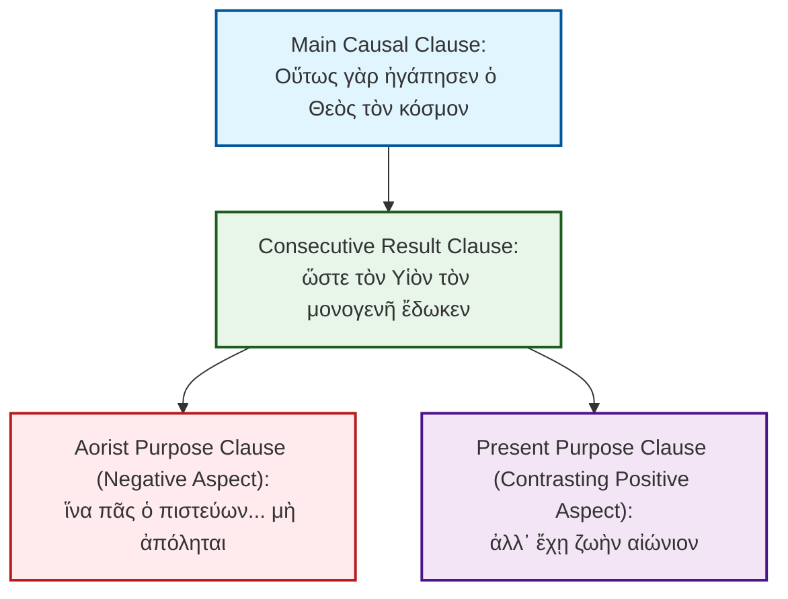

# Step 002: Original Greek Text Structure (John 3:16)

**Persona**: Biblical Linguistic Analyst & Textual Critic

This step displays the original Koine Greek text of John 3:16 from the Open Hebrew-Greek Bible (OHGB), alongside a structural and clause-by-clause syntactic division to illustrate the rhetorical flow of the verse.

## Koine Greek Text (OHGB)

> **John 3:16 (OHGB)**
> Οὕτως γὰρ ἠγάπησεν ὁ Θεὸς τὸν κόσμον ὥστε τὸν Υἱὸν τὸν μονογενῆ ἔδωκεν ἵνα πᾶς ὁ πιστεύων εἰς αὐτὸν μὴ ἀπόληται ἀλλ᾽ ἔχῃ ζωὴν αἰώνιον

---

## Syntactic & Clause Structure Analysis

The Greek sentence in John 3:16 is a syntactical masterpiece, moving from the foundational divine motivation (love), through historical action (giving), to the ultimate purpose (deliverance from destruction and the gift of eternal life). It can be divided into four distinct clauses:

### 1. The Main Causal Core (Salvation's Motivation)
*   **Greek Text**: Οὕτως γὰρ ἠγάπησεν ὁ Θεὸς τὸν κόσμον
*   **Transliteration**: *Houtōs gar ēgapēsen ho Theos ton kosmon*
*   **Grammatical Breakdown**:
    *   **Οὕτως** (*houtōs*): Adverb of manner pointing forward to the *ὥστε* clause ("in this way").
    *   **γὰρ** (*gar*): Causal conjunction ("for") linking this verse back to the preceding illustration of the bronze serpent in the wilderness (John 3:14-15).
    *   **ἠγάπησεν** (*ēgapēsen*): Verb, Aorist Active Indicative, 3rd Person Singular (from *ἀγαπάω*). The aorist tense denotes a historical, definitive, and complete action.
    *   **ὁ Θεὸς** (*ho Theos*): Subject Noun, Nominative Masculine Singular.
    *   **τὸν κόσμον** (*ton kosmon*): Direct Object Noun, Accusative Masculine Singular.

### 2. The Consecutive Result Clause (Historical Action)
*   **Greek Text**: ὥστε τὸν Υἱὸν τὸν μονογενῆ ἔδωκεν
*   **Transliteration**: *hōste ton Huion ton monogenē edōken*
*   **Grammatical Breakdown**:
    *   **ὥστε** (*hōste*): Conjunction introducing a clause of actual, historical result.
    *   **τὸν Υἱὸν τὸν μονογενῆ** (*ton Huion ton monogenē*): Accumulation of definite articles and words emphasizes the specific, unique identity of the gift. "The Son, the unique and only one."
    *   **ἔδωκεν** (*edōken*): Verb, Aorist Active Indicative, 3rd Person Singular (from *δίδωμι*). Like *ἠγάπησεν*, the definitive aorist denotes the historical reality of the crucifixion and incarnation.

### 3. The Purpose Clauses (Negative Aspect)
*   **Greek Text**: ἵνα πᾶς ὁ πιστεύων εἰς αὐτὸν μὴ ἀπόληται
*   **Transliteration**: *hina pas ho pisteuōn eis auton mē apolētai*
*   **Grammatical Breakdown**:
    *   **ἵνα** (*hina*): Purpose-conjunction ("so that / in order that").
    *   **πᾶς ὁ πιστεύων** (*pas ho pisteuōn*): Subject, combining the universal adjective *πᾶς* with the Nominative Masculine Singular Present Active Participle *πιστεύων*. The present tense denotes a continuous, active, ongoing trust rather than a static intellectual assent.
    *   **εἰς αὐτὸν** (*eis auton*): Prepositional phrase of motion/direction (*εἰς* + accusative), emphasizing that saving faith is directed *into* the person of Christ.
    *   **μὴ** (*mē*): Negative particle used with subjunctive verbs.
    *   **ἀπόληται** (*apolētai*): Verb, Aorist Middle Subjunctive, 3rd Person Singular (from *ἀπολλύω*). The aorist tense indicates a final, complete perishing.

### 4. The Purpose Clauses (Positive Aspect)
*   **Greek Text**: ἀλλ᾽ ἔχῃ ζωὴν αἰώνιον
*   **Transliteration**: *all’ echē zōēn aiōnion*
*   **Grammatical Breakdown**:
    *   **ἀλλ᾽** (*all’*): Strong adversarial conjunction *ἀλλά* (elided before a vowel), establishing a sharp contrast to perishing.
    *   **ἔχῃ** (*echē*): Verb, Present Active Subjunctive, 3rd Person Singular (from *ἔχω*). The tense shifts to the *present tense* to denote continuous, ongoing, and vital possession of eternal life in the present.
    *   **ζωὴν αἰώνιον** (*zōēn aiōnion*): Noun and Adjective in the Accusative case, denoting "eternal life."