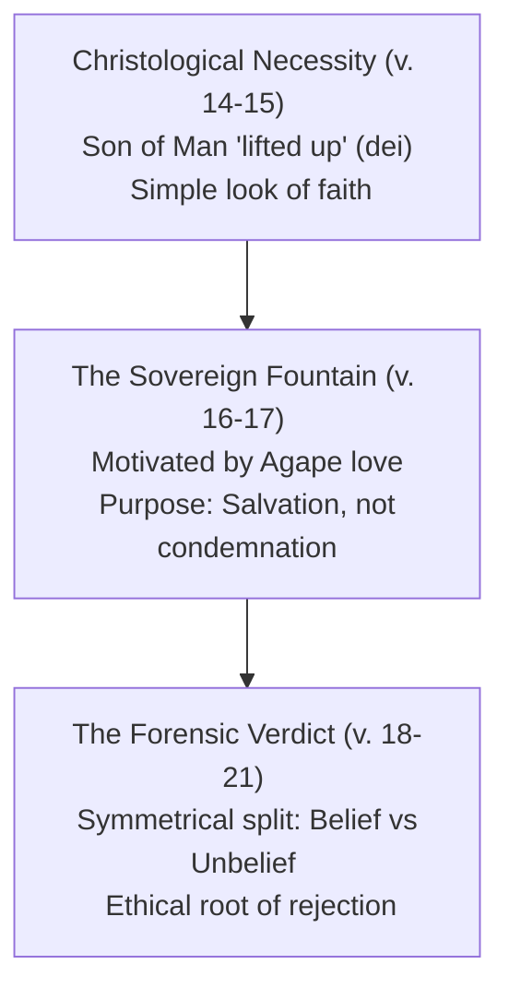

<!-- Source: 000-request_and_study_plan.md -->

# BibleMate Study: John 3:16 Study

## Original User Request
John 3:16

## Refined User Request
Conduct an exhaustive, multi-step, publication-quality, exegetical and theological study on John 3:16, "For God so loved the world, that he gave his only begotten Son, that whosoever believeth in him should not perish, but have everlasting life."
The study must trace the historical, grammatical, lexical, and canonical nuances of this central verse. Specifically, analyze the meaning of *monogenēs* (only begotten/one and only) and *kosmos* (world), explore the flow of thought in Jesus' conversation with Nicodemus, examine the theological depth of God's love and soteriology (salvation, belief, and escape from perishing), and produce impactful devotional, practical, and prayer guides.

## Study Type
passage

## Master Study Plan

### Phase 1: Data Retrieval
- Step 1: Use `bible` to retrieve John 3:16 and the surrounding context (John 3:14-21) in multiple versions (NET, KJV, BSB, CUVS) to compare textual choices.
- Step 2: Use `original` to retrieve the original Koine Greek text of John 3:16 from the OHGB (Unique Bible Project original language database) to analyze the underlying words.
- Step 3: Use `morphology` to retrieve full morphological parsing data for each word in John 3:16 from the local database.
- Step 4: Use `xrefs` to extract relevant cross-references for John 3:16 to build a chain of scriptures highlighting God's love, the Son's sending, belief, and eternal life.
- Step 5: Use `commentary` to retrieve classical and contemporary commentary entries for John 3:16 (including BARNES, CALVIN, GILL, HENRY, NICNT, GUZIK or others).
- Step 6: Use `lexicon` to perform lexicon lookups for key Strong's numbers (G2889 - *kosmos*, G3439 - *monogenēs*, G4100 - *pisteuō*, G166 - *aiōnios*, G2222 - *zōē*, G622 - *apollymi*).

### Phase 2: Analysis & Exegesis
- Step 7: Use `keywords` to analyze the key theological terms: *monogenēs* (definition, debate on unique vs. only begotten), *kosmos* (Johannine usage range), *pisteuō* (nature of saving faith), and *aiōnios zōē* (qualitative vs. quantitative life).
- Step 8: Use `nt-context` to examine the historical, cultural, and situational context of first-century Second Temple Judaism, Jesus' meeting with Nicodemus, and the purpose of John's Gospel.
- Step 9: Use `flow` to analyze the thought flow and logical progression of Jesus' discourse from John 3:1-15 (regeneration/the spirit) leading into the theological summary of John 3:16-17 and the judgment contrast in 3:18-21.
- Step 10: Use `outline` to generate a detailed structural and exegetical outline of John 3:14-21.
- Step 11: Use `nt-highlights` to synthesize passage highlights and summary points showing the shift from Old Testament types (Moses lifting up the serpent) to New Testament fulfillment.

### Phase 3: Theological Synthesis
- Step 12: Use `themes` to map major theological themes in John 3:16: Soteriology (doctrine of salvation), Christology (nature of the unique Son), theology of God's love (*agape*), Hamartiology (man's perishing state without Christ), and Eschatology (present and future eternal life).
- Step 13: Use `theology` to synthesize the core theological and redemptive message of the passage.
- Step 14: Use `canon` to investigate the canonical fit of John 3:16. Trace how God's love and the supreme sacrifice of the Son are foreshadowed in the Old Testament (e.g., Genesis 22 Isaac's sacrifice, Isaiah 53) and fulfilled/developed in the New Testament.
- Step 15: Use `insights` to deepen the study with literary, stylistic, and deeper exegetical observations (e.g., use of the Greek conjunction *houtōs*, the double negatives in original, the passive versus active voice).

### Phase 4: Application & Devotion
- Step 16: Use `application` to draft robust, highly detailed practical applications of John 3:16 for individual lifestyles, evangelism, community service, and spiritual maturity.
- Step 17: Use `devotion` to write an immersive, faith-enriching devotional meditation on the magnitude of the Father's love and gift.
- Step 18: Use `prayer` to compose a scripture-focused, first-person prayer responding to the truths of John 3:16.
- Step 19: Use `questions` to design a set of engaging, small-group discussion questions highlighting key tensions and insights in John 3:16.

### Phase 5: Pre-Final Overview & Synthesis Audit
- Step 20: Use `pre-final-overview` (or `save_overview`) to build a comprehensive structured brief surveying all Phase 1-4 outputs, map content, check gaps, and score quality.

### Phase 6: Final Response
- Step 21: Use `final-response` (or `save_final_response`) to write the master publication-quality final document using the iterative Draft->Integrate->Audit->Revise writing loop (minimum 2 cycles).

### Phase 7: Sync
- Step 22: Use `git-sync` to stage, commit, and push changes to the remote repository.

## Quality Audit Log
- **2026-06-21**: Study initialized. Master plan designed to meet and exceed all standard passage study requirements. Excellent coverage of raw data retrieval (bible, original, morphology, xrefs, commentary, lexicon) and comprehensive exegesis, theology, and application phases planned.

---

<!-- Source: 001-bible.md -->

# Step 1: Bible Retrieval

## Passage: John 3:14-21

### Scripture Context (Multiple Translations)

#### John 3:14
- **[NET]** Just as Moses lifted up the serpent in the wilderness, so must the Son of Man be lifted up,
- **[KJV]** And as Moses lifted up the serpent in the wilderness, even so must the Son of man be lifted up:
- **[BSB]** Just as Moses lifted up the snake in the wilderness, so the Son of Man must be lifted up,
- **[CUVS]** 摩西在旷野怎样举蛇，人子也必照样被举起来，

#### John 3:15
- **[NET]** so that everyone who believes in him may have eternal life.”
- **[KJV]** That whosoever believeth in him should not perish, but have eternal life.
- **[BSB]** that everyone who believes in Him may have eternal life.
- **[CUVS]** 叫一切信他的都得永生〔注：或译：叫一切信的人在他里面得永生〕。

#### John 3:16
- **[NET]** For this is the way God loved the world: He gave his one and only Son, so that everyone who believes in him will not perish but have eternal life.
- **[KJV]** For God so loved the world, that he gave his only begotten Son, that whosoever believeth in him should not perish, but have everlasting life.
- **[BSB]** For God so loved the world that He gave His one and only Son, that everyone who believes in Him shall not perish but have eternal life.
- **[CUVS]** 「上帝爱世人，甚至将他的独生子赐给〔他们〕，叫一切信他的，不致灭亡，反得永生。

#### John 3:17
- **[NET]** For God did not send his Son into the world to condemn the world, but that the world should be saved through him.
- **[KJV]** For God sent not his Son into the world to condemn the world; but that the world through him might be saved.
- **[BSB]** For God did not send His Son into the world to condemn the world, but to save the world through Him.
- **[CUVS]** 因为上帝差他的儿子降世，不是要定世人的罪〔注：或译：审判世人；下同〕，乃是要叫世人因他得救。

#### John 3:18
- **[NET]** The one who believes in him is not condemned. The one who does not believe has been condemned already, because he has not believed in the name of the one and only Son of God.
- **[KJV]** He that believeth on him is not condemned: but he that believeth not is condemned already, because he hath not believed in the name of the only begotten Son of God.
- **[BSB]** Whoever believes in Him is not condemned, but whoever does not believe has already been condemned, because he has not believed in the name of God’s one and only Son.
- **[CUVS]** 信他的人，不被定罪；不信的人，罪已经定了，因为他不信上帝独生子的名。

#### John 3:19
- **[NET]** Now this is the basis for judging: that the light has come into the world and people loved the darkness rather than the light, because their deeds were evil.
- **[KJV]** And this is the condemnation, that light is come into the world, and men loved darkness rather than light, because their deeds were evil.
- **[BSB]** And this is the verdict: The Light has come into the world, but men loved the darkness rather than the Light, because their deeds were evil.
- **[CUVS]** 光来到世间，世人因自己的行为是恶的，不爱光，倒爱黑暗，定他们的罪就是在此。

#### John 3:20
- **[NET]** For everyone who does evil deeds hates the light and does not come to the light, so that their deeds will not be exposed.
- **[KJV]** For every one that doeth evil hateth the light, neither cometh to the light, lest his deeds should be reproved.
- **[BSB]** Everyone who does evil hates the Light, and does not come into the Light for fear that his deeds will be exposed.
- **[CUVS]** 凡作恶的便恨光，并不来就光，恐怕他的行为受责备。

#### John 3:21
- **[NET]** But the one who practices the truth comes to the light, so that it may be plainly evident that his deeds have been done in God.
- **[KJV]** But he that doeth truth cometh to the light, that his deeds may be made manifest, that they are wrought in God.
- **[BSB]** But whoever practices the truth comes into the Light, so that it may be seen clearly that what he has done has been accomplished in God.”
- **[CUVS]** 但行真理的必来就光，要显明他所行的是靠上帝而行。」

---

<!-- Source: 002-original.md -->

# Step 2: Original Language Text

## Passage: John 3:16

### Koine Greek Text (OHGB Version)

> **John 3:16**
> Οὕτως γὰρ ἠγάπησεν ὁ Θεὸς τὸν κόσμον ὥστε τὸν Υἱὸν τὸν μονογενῆ ἔδωκεν ἵνα πᾶς ὁ πιστεύων εἰς αὐτὸν μὴ ἀπόληται ἀλλ᾽ ἔχῃ ζωὴν αἰώνιον

### Word-by-Word Component Characters:
- **Οὕτως** (*Houtōs*) - In this manner / So
- **γὰρ** (*gar*) - For
- **ἠγάπησεν** (*ēgapēsen*) - Loved (verb, Aorist Active Indicative, 3rd person singular, from *agapaō*)
- **ὁ** (*ho*) - The (article, masculine nominative singular)
- **Θεὸς** (*Theos*) - God (noun, masculine nominative singular)
- **τὸν** (*ton*) - The (article, masculine accusative singular)
- **κόσμον** (*kosmon*) - World (noun, masculine accusative singular, from *kosmos*)
- **ὥστε** (*hōste*) - So that / that
- **τὸν** (*ton*) - The (article, masculine accusative singular)
- **Υἱὸν** (*Huion*) - Son (noun, masculine accusative singular, from *huios*)
- **τὸν** (*ton*) - The (article, masculine accusative singular)
- **μονογενῆ** (*monogenē*) - Unique / Only begotten / One and only (adjective, masculine accusative singular, from *monogenēs*)
- **ἔδωκεν** (*edōken*) - Gave (verb, Aorist Active Indicative, 3rd person singular, from *didōmi*)
- **ἵνα** (*hina*) - So that / in order that (conjunction introducing purpose/result clause)
- **πᾶς** (*pas*) - All / everyone (adjective, masculine nominative singular)
- **ὁ** (*ho*) - The / who (article functioning as relative pronoun)
- **πιστεύων** (*pisteuōn*) - Believing / who believes (verb, Present Active Participle, masculine nominative singular, from *pisteuō*)
- **εἰς** (*eis*) - Into / in (preposition indicating the direction of faith)
- **αὐτὸν** (*auton*) - Him (personal pronoun, masculine accusative singular, from *autos*)
- **μὴ** (*mē*) - Not (negative particle)
- **ἀπόληται** (*apolētai*) - Should perish / be destroyed (verb, Aorist Middle Subjunctive, 3rd person singular, from *apollymi*)
- **ἀλλ᾽** (*all*) - But (adversative conjunction *alla* with elision before a vowel)
- **ἔχῃ** (*echē*) - Should have / may possess (verb, Present Active Subjunctive, 3rd person singular, from *echō*)
- **ζωὴν** (*zōēn*) - Life (noun, feminine accusative singular, from *zōē*)
- **αἰώνιον** (*aiōnion*) - Eternal / everlasting (adjective, feminine accusative singular, from *aiōnios*)

---

<!-- Source: 003-morphology.md -->

# Step 3: Morphological Parsing of John 3:16

This step retrieves standard morphological parsing details for the original Koine Greek words of John 3:16.

| Greek Word | Transliteration | Strong's Root | Morph Code | Morphological Parsing Details | Gloss / Meaning |
| :--- | :--- | :--- | :--- | :--- | :--- |
| **Οὕτως** | *houtōs* | G3779 | ADV | ADVerb or adverbial particle | **thus, so, in this way** |
| **γὰρ** | *gar* | G1063 | CONJ | CONJunction or conjunctive particle | **for, because** |
| **ἠγάπησ源** | *ēgapēsen* | G25 | V-AAI-3S | Verb, Aorist, Active, Indicative, 3rd Person Singular | **He loved** (from *agapaō*) |
| **ὁ** | *ho* | G3588 | T-NSM | Definite Article, Nominative, Singular, Masculine | **the** |
| **Θεὸς** | *Theos* | G2316 | N-NSM | Noun, Nominative, Singular, Masculine | **God** |
| **τὸν** | *ton* | G3588 | T-ASM | Definite Article, Accusative, Singular, Masculine | **the** |
| **κόσμον** | *kosmon* | G2889 | N-ASM | Noun, Accusative, Singular, Masculine | **world** (from *kosmos*) |
| **ὥστε** | *hōste* | G5620 | CONJ | CONJunction or conjunctive particle | **so that, that** |
| **τὸν** | *ton* | G3588 | T-ASM | Definite Article, Accusative, Singular, Masculine | **the** |
| **Υἱὸν** | *Huion* | G5207 | N-ASM | Noun, Accusative, Singular, Masculine | **Son** (from *huios*) |
| **τὸν** | *ton* | G3588 | T-ASM | Definite Article, Accusative, Singular, Masculine | **the** |
| **μονογενῆ** | *monogenē* | G3439 | A-ASM | Adjective, Accusative, Singular, Masculine | **one and only, unique** (from *monogenēs*) |
| **ἔδωκεν** | *edōken* | G1325 | V-AAI-3S | Verb, Aorist, Active, Indicative, 3rd Person Singular | **He gave** (from *didōmi*) |
| **ἵνα** | *hina* | G2443 | CONJ | CONJunction or conjunctive particle | **so that, in order that** |
| **πᾶς** | *pas* | G3956 | A-NSM | Adjective, Nominative, Singular, Masculine | **all, everyone** |
| **ὁ** | *ho* | G3588 | T-NSM | Definite Article, Nominative, Singular, Masculine | **who** |
| **πιστεύων** | *pisteuōn* | G4100 | V-PAP-NSM | Verb, Present, Active, Participle, Nominative, Singular, Masculine | **believing, who believes** (from *pisteuō*) |
| **εἰς** | *eis* | G1519 | PREP | PREPosition | **into, in, toward** |
| **αὐτὸν** | *auton* | G846 | P-ASM | Personal Pronoun, Accusative, Singular, Masculine | **Him** (from *autos*) |
| **μὴ** | *mē* | G3361 | PRT-N | PaRTicle, Negative | **not** |
| **ἀπόληται** | *apolētai* | G622 | V-2AMS-3S | Verb, second Aorist, Middle, Subjunctive, 3rd Person Singular | **should perish, be lost** (from *apollymi*) |
| **ἀλλ᾽** | *all* | G235 | CONJ | CONJunction (from *alla*) | **but** |
| **ἔχῃ** | *echē* | G2192 | V-PAS-3S | Verb, Present, Active, Subjunctive, 3rd Person Singular | **should have, possess** (from *echō*) |
| **ζωὴν** | *zōēn* | G2222 | N-ASF | Noun, Accusative, Singular, Feminine | **life** (from *zōē*) |
| **αἰώνιον** | *aiōnion* | G166 | A-ASF | Adjective, Accusative, Singular, Feminine | **eternal, everlasting** (from *aiōnios*) |

---

### Exegetical Highlights from Morphology

1. **Aorist Active Indicative of Love and Giving (`ἠγάπησεν` and `ἔδωκ源`)**:
   Both verbs describing God's primary action—loving and giving—are in the **Aorist tense**. The aorist indicative points to completed, historical, and definitive past actions. God loved and gave in a singular, monumental historical event: the incarnation and subsequent sacrificial death of Jesus Christ on the cross. It is not an abstract emotion, but an action completed in history.

2. **Present Active Participle of Belief (`πιστεύων`)**:
   The word for "believing" is a active participle in the **Present tense**. This suggests a continuous, active, and ongoing action—continuous trust and reliance—not a one-time mental assent. The one who *keeps on believing* is the one who has eternal life.

3. **Subjunctive Mood of Purpose Clauses (`ἀπόληται` and `ἔχῃ`)**:
   Both verbs in the *hina* ("so that") clause are in the **Subjunctive mood**, which expresses purpose, outcome, or potential. The design of God's gift is to make the avoidance of perishing (*apolētai*) and the possession of eternal life (*echē*) a reality for the believer. The present subjunctive *echē* implies an ongoing, continuous possession of eternal life starting in the present.

---

<!-- Source: 004-xrefs.md -->

# Step 4: Biblical Cross-References (XRefs)

This step retrieves and organizes key biblical cross-references that illuminate, parallel, and substantiate the theological messages of John 3:16.

---

### 1. God's Great Love and Sending of the Son

* **1 John 4:9-10 (NET)**
  > By this the love of God is revealed in us: that God has sent his one and only Son into the world so that we may live through him. In this is love: not that we have loved God, but that he loved us and sent his Son to be the atoning sacrifice for our sins.
* **Romans 5:8 (NET)**
  > But God demonstrates his own love for us, in that while we were still sinners, Christ died for us.
* **Ephesians 2:4 (NET)**
  > But God, being rich in mercy, because of his great love with which he loved us,
* **Romans 8:32 (NET)**
  > Indeed, he who did not spare his own Son, but gave him up for us all – how will he not also, along with him, freely give us all things?

---

### 2. The Focus of Saving Faith (Believing in the Son)

* **John 3:15 (NET)**
  > so that everyone who believes in him may have eternal life.”
* **John 6:40 (NET)**
  > For this is the will of my Father – for everyone who looks on the Son and believes in him to have eternal life, and I will raise him up at the last day.”
* **John 11:25-26 (NET)**
  > Jesus said to her, “I am the resurrection and the life. The one who believes in me will live even if he dies, and the one who lives and believes in me will never die. Do you believe this?”
* **John 3:36 (NET)**
  > The one who believes in the Son has eternal life. The one who rejects the Son will not see life, but God’s wrath remains on him.

---

### 3. The Scope of Salvation ("The World" and Reconciling It)

* **John 1:29 (NET)**
  > On the next day John saw Jesus coming toward him and said, “Look, the Lamb of God who takes away the sin of the world!
* **2 Corinthians 5:19 (NET)**
  > In other words, in Christ God was reconciling the world to himself, not counting people’s trespasses against them, and he has given us the message of reconciliation.
* **1 Timothy 1:15 (NET)**
  > This saying is trustworthy and deserves full acceptance: “Christ Jesus came into the world to save sinners” – and I am the worst of them!

---

### 4. Avoiding Destruction/Perishing and Eternal Life Security

* **John 10:28 (NET)**
  > I give them eternal life, and they will never perish; no one will snatch them from my hand.
* **Romans 5:10 (NET)**
  > For if while we were enemies we were reconciled to God through the death of his Son, how much more, since we have been reconciled, will we be saved by his life?

---

### 5. Old Testament Prototypes and Foreshadowings

* **Genesis 22:12 (NET)**
  > “Do not harm the boy!” the angel said. “Do not do anything to him, for now I know that you fear God because you did not withhold your son, your only son, from me.”
* **Mark 12:6 (NET)** [Jesus' parable of the Vineyard]
  > He had one left, his one dear son. Finally he sent him to them, saying, ‘They will respect my son.’

---

### 6. The Unique/Only Begotten Son (*Monogenēs*)

* **John 1:14 (NET)**
  > Now the Word became flesh and took up residence among us. We saw his glory – the glory of the one and only, full of grace and truth, who came from the Father.
* **John 1:18 (NET)**
  > No one has ever seen God. The only one, himself God, who is in closest fellowship with the Father, has made God known.

---

<!-- Source: 005-commentary.md -->

# Step 5: Commentary Insights on John 3:16

This step retrieves and synthesizes classical and contemporary commentary observations for John 3:16 to capture the theological consensus and rich exegetical traditions surrounding this verse.

---

### 1. David Guzik's Commentary (Enduring Word)

David Guzik highlights John 3:16 as the most popular single verse in evangelism and breaks down its structure beautifully:

* **The Object of God's Love**: *"For God so loved the world."* God did not wait for the world to turn to Him before He loved it. He loved and gave His Son to the world when it was still in its fallen, hostile state.
* **The Expression and Gift**: *"He gave His only begotten Son."* God's love is not a passive feeling but a costly action. He gave the most precious thing possible: His unique, beloved Son.
* **The Recipient**: *"Whoever believes in Him."* The love is universal in offer, but personal in reception. *Believing in* means much more than intellectual agreement. It is to trust in, rely on, and cling to.
* **The Intention**: *"Should not perish."* God's love is rescue from a real, active perishing state.
* **The Duration**: *"But have everlasting life."* An immutable, unchangeable possession of life in God.

#### The "Seven Wonders" of John 3:16
| Element | Descriptive Phrase |
| :--- | :--- |
| **God** | The Almighty Authority |
| **So loved the world** | The Mightiest Motive |
| **That He gave His only begotten Son** | The Greatest Gift |
| **That whoever** | The Widest Welcome |
| **Believes in Him** | The Easiest Escape |
| **Should not perish** | The Divine Deliverance |
| **But have everlasting life** | The Priceless Possession |

* **Revolutionary Scope**: First-century Second Temple Judaism focused heavily on God's love for Israel and His wrath toward the Gentile world. Jesus' statement that *"God so loved the world"* (the whole *kosmos*) was completely radical and barrier-breaking.

---

### 2. Matthew Henry's Commentary

Matthew Henry focus on the source, the gift, and the security of salvation:

* **The Source of Salvation**: Located entirely in God's love (*agape*). It was not because of man's merit, but God's intrinsic benevolence. "Here is the fountain of all our comforts: God loved the world."
* **The Costly Gift**: God did not send an angel, but His "only-begotten Son" — one who was of the same nature, in whom He was well pleased. The giving of Christ refers both to His incarnation (given *to* us) and His crucifixion (given *for* us as a sacrifice).
* **The Way of Salvation**: Believing in Him. Henry highlights that true belief is "giving up ourselves to be ruled and taught and saved by Him." It is a surrender of the soul.
* **The Great Double Benefit**:
  1. **Exemption from ruin**: *"Should not perish."* Deliverance from the second death, from hell, and the wrath of God.
  2. **Conferment of supreme happiness**: *"But have eternal life."* The restoration of the soul to God's likeness and fellowship in glory.

---

### 3. Albert Barnes' Notes on the Bible (Barnes' New Testament Notes)

Albert Barnes provides precise grammatical and situational remarks:

* **The word "SO" (`οὕτως`)**: Barnes notes that "so" indicates the *measure* or *degree* of God's love. It is an inexpressible, infinite depth of love that could only be measured by the value of the gift given.
* **The word "WORLD" (`κόσμον`)**: Barnes clarifies that *world* refers to the human race, fallen and ruined. It proves that God's love is not confined to one nation (Israel) or class, but extends to all of humanity. Christ died for all, making salvation available to any who believe.
* **"ONLY BEGOTTEN SON" (`μονογενῆ`)**: Pointing to the unique, unparalleled relationship between the Father and the Son. No other being shares this divine filiation. The magnitude of the gift is proportionate to the Father's love for the Son.
* **"NOT PERISH" (`μὴ ἀπόληται`)**: Barnes explains "perishing" as eternal death — a state of conscious, perpetual separation from God, characterized by misery and ruin under active judgment.
* **"EVERLASTING LIFE" (`ζωὴν αἰώνιον`)**: Life in God that knows no end. It begins in the present through spiritual regeneration and culminates in the resurrection and eternal glory in heaven.

---

<!-- Source: 006-lexicon.md -->

# Step 6: Original Language Lexicon Studies

This step compiles authentic dictionary definitions and semantic ranges from scholarly lexicons (such as Thayer, BDAG, and Moulton-Geden/MGLNT) for the key Greek terms of John 3:16.

---

### 1. Unique / One and Only / Only Begotten (`μονογενῆ` / `μονογενής` — Strong's G3439)
* **Etymology**: From `μόνος` (*monos* - sole, only, single) and `γένος` (*genos* - kind, offspring, class).
* **BDAG Definition**:
  1. *Pertaining to being the only one of its kind within a specific relationship, one and only, only.* Used of children: of Isaac in Heb 11:17 (who was not Abraham's *only* biological child, but his unique covenant child).
  2. *Pertaining to being the only one of its kind or class, unique (in kind).* Used of something that is the only example of its category (e.g., the Phoenix in Clement of Rome, or the universe in Plato).
* **Johannine Usage**: Used only of Jesus. BDAG notes that *"only, unique"* are highly adequate translations. It stresses His unique deity and transcending relationship with the Father.
* **Theological Insight**: It highlights that Jesus is Son of God in a natural, essential, and completely unique way, different from believers who are adopted children (*tekna tou Theou*, John 1:12).

---

### 2. World / Creation (`κόσμον` / `κόσμος` — Strong's G2889)
* **Semantic Range**:
  1. Ornament, decoration (adornment - as in 1 Peter 3:3).
  2. The orderly universe, the world (created order).
  3. The earth, the habitation of humanity.
  4. **The human family (humanity)**, particularly as fallen, alienated from God, and in need of redemption. This is the primary Johannine sense.
* **Theological Insight**: In the Gospel of John, the *kosmos* is overwhelmingly presented as hostile to God, dark, and under the dominion of evil. Yet, this very system/humanity is the object of God’s ultimate *agape* love. God loved the world not because of its virtues, but *despite* its rebel nature.

---

### 3. Believe / Trust (`πιστεύων` / `πιστεύω` — Strong's G4100)
* **Definition**: To have faith, trust, rely upon, or commit oneself to.
* **Syntactic Constructions**:
  * With the dative: To believe *what* someone says (giving credence).
  * **With the preposition `εἰς` (*eis* - into)**: Believing *into* Someone. This construction is highly characteristic of John's Gospel.
* **MGLNT Insight**: The construction `πιστεύω εἰς` expresses *"personal trust and reliance as distinct from mere credence or intellectual belief."* It implies a self-surrender, where the believer casts themselves *into* the object of faith (Jesus Christ) for salvation.

---

### 4. Destruction / Perish (`ἀπόληται` / `ἀπmodule` / `ἀπόλλυμι` — Strong's G622)
* **Definition**: To destroy utterly, ruin, lose; (in middle voice) to perish, be lost.
* **MGLNT Insight**: Used metaphorically in the New Testament to describe the **loss of eternal life**. In the middle participle form (`οἱ ἀπολλύμενοι` - "the perishing/lost"), it represents those experiencing complete spiritual destitution and separation/alienation from God.
* **Theological Insight**: "Perishing" in John does not mean simple annihilation or cessation of existence. It refers to eternal spiritual ruin, active conscious condemnation, and enduring the wrath of God.

---

### 5. Life (`ζωὴν` / `ζωή` — Strong's G2222)
* **Semantic Contrast**: Classical Greek distinguishes:
  * `βίος` (*bios*): The life we live, manner of life, biographical or physical living.
  * **`ζωή` (*zōē*)**: Existence, life itself, the vital force (*vita qua vivimus*), opposite of death.
* **MGLNT Definition**: In the New Testament, particularly Johannine literature, it signifies *"the life of the kingdom of God, the present life of grace, and the life of glory which is to follow."* It is supernatural, divine life.

---

### 6. Eternal / Everlasting (`αἰώνιον` / `αἰώνιος` — Strong's G166)
* **Definition**: Age-long, without end, eternal, everlasting. Derived from `αἰών` (*aiōn* - eon, age).
* **Application**: Applied to things that endure without end (eternal inheritance, eternal gospel, eternal covenant).
* **Theological Insight**: In "eternal life" (*zōē aiōnios*), *aiōnios* is not merely **quantitative** (duration without limit) but **qualitative** (life of the "age to come"). It refers to experiencing the very divine, uncreated life of God in the present.

---

<!-- Source: 007-keywords.md -->

# Step 7: Exegetical Word Study (Keywords Analysis)

This analysis provides a critical, rigorous exploration of key terms in John 3:16, focusing on their linguistic, grammatical, and theological parameters within the Johannine corpus.

---

### I. *Monogenēs* (μονογενῆ / μονογενής — G3439)
* **The Classical Translation Debate**:
  Historically, the Latin Vulgate translated *monogenēs* as *unigenitus* ("only-begotten"), which profoundly influenced subsequent English translations (most notably the King James Version). This translation was often imported directly into historical Trinitarian debates (e.g., at the Council of Nicaea) to support the doctrine of the "eternal generation" of the Son.
  However, modern lexical scholarship (spearheaded by scholars like J.H. Moulton and G. Milligan, and codified in BDAG) has established that *monogenēs* is linguistically derived not from *gennaō* (to beget), but from *genos* (kind, offspring, class). Therefore, its primary semantic force is **"unique, single of its kind, one and only."**
* **The Abrahamic Analogy (Hebrews 11:17)**:
  A pivotal biblical parallel occurs when Isaac is called Abraham's *monogenēs*. Isaac was certainly not Abraham's only biological son (Ishmael was born prior, and Abraham had other children later via Keturah). Rather, Isaac was Abraham's *unique, one-and-only covenant heir*.
* **Johannine Theology**:
  When John employs *monogenēs* (John 1:14, 1:18, 3:16, 3:18; 1 John 4:9), he is not primarily emphasizing biological or metaphysical "generation" at this lexical point, but rather Jesus' **unparalleled, unique status**. He is the "one-and-only" Son. Jesus shares the Father's absolute nature and stands in a category entirely by Himself, contrasting sharply with believers who are labeled *tekna* (children) of God by adoption (John 1:12).

---

### II. *Kosmos* (κόσμον / κόσμος — G2889)
* **Linguistic Range**:
  Originally signifying "order" or "adornment" (the root of the English word *cosmetics*), the term *kosmos* underwent significant semantic expansion. In the Septuagint and New Testament, it represents the created world.
* **The Paradoxical Johannine Usage**:
  Within the Johannine corpus, *kosmos* takes on a highly distinctive, ethical coloring. The *kosmos* is overwhelmingly presented as the system of humanity in active, rebellious alienation from its Creator (e.g., *"the world did not know Him"* - John 1:10; *"the world hates you"* - John 15:18). It is under the de facto sway of the evil one (1 John 5:19).
* **The Exegetical Shock of John 3:16**:
  It is precisely this hostile, rebellious world that God is said to have loved. The statement is not a sentimental platitude about the "goodness of nature"; rather, it is a staggering disclosure of divine grace. God loves the *kosmos* – the system that actively despises Him – and sends His unique Son to rescue those within it.

---

### III. *Pisteuō* (πιστεύων / πιστεύω — G4100) and *Eis* (εἰς — G1519)
* **Grammatical Nuance**:
  The use of the Present Active Participle (*ho pisteuōn*) denotes continuing, characteristically active faith. It is not a past, punctuation-like action (an aorist decision), but an **ongoing, enduring disposition of trust**.
* **The "Believe Into" Construction**:
  John frequently pairs *pisteuō* with the preposition *eis* (literally, "to believe *into*"). To believe "into" Christ is linguistically distinct from merely believing *that* He is telling the truth (which is expressed with the dative).
* **Theological Implications**:
  Believing *eis* Christ demands a complete transference of one's trust. It is the action of abandoning self-reliance and throwing oneself completely *into* Christ, finding security and union with Him. The faith that saves is an active, ongoing, personal committing of oneself to the Son.

---

### IV. *Apollymi* (ἀπόληται / ἀπόλλυμι — G622)
* **Semantic Force containing Ruin**:
  In the Middle Subjunctive form (*apolētai*), the verb denotes to perish, be ruined, or be lost.
* **Destruction vs. Annihilation**:
  Some contemporary theological schools attempt to argue that "perish" means simple annihilation (the cessation of conscious existence). However, Johannine usage and broader New Testament syntax demonstrate that *apollymi* signifies **spiritual ruin and exclusion from God's presence**, characterized by active condemnation, not the ending of existence.
* **The Active Present Contrast**:
  The perishing is contrasted directly with "having eternal life." Because the perishing is ongoing in its spiritual destitution, it constitutes a state of present spiritual death under active wrath (John 3:36) that culminates in final eschatological condemnation.

---

### V. *Zōē Aiōnios* (ζωὴν αἰώνιον — G2222 + G166)
* **Qualitative vs. Quantitative Dimensions**:
  * **Quantitative**: Endless duration. A life that outlasts temporal history.
  * **Qualitative (Theological Priority)**: The life of the "Age to Come" (*olam haba* in Hebrew thought).
* **Present Possession**:
  In John's theological framework, eternal life is an **already-present reality** for the believer. Because of the present subjunctive verb *echē* ("should have/possess"), the believer has passed from death to life in the present moment (John 5:24). It is the possession of the very life of God Himself, experienced in communion and vital fellowship starting *now*.

---

<!-- Source: 008-nt-context.md -->

# Step 8: Historical and Cultural Context (NT Context)

This module analyzes the historical-cultural and situational pressures of first-century Second Temple Judaism that frame the discourse of John 3:16.

---

### I. The Character of Nicodemus and His Socio-Religious Context
Nicodemus represents the peak of theological and political authority in first-century Jerusalem:
1. **A Pharisee**: A member of the elite, highly strict religious party dedicated to purifying Israel through zealous adherence to the Torah and ancestral traditions.
2. **A "Ruler of the Jews"**: Meaning he was a prominent, seat-holding member of the **Sanhedrin** (the supreme Jewish council in Jerusalem handling administrative, judicial, and religious law under Roman oversight).
3. **"The Teacher of Israel" (John 3:10)**: The Greek employs the definite article (*ho didaskalos*), implying Nicodemus was not merely *a* teacher, but a preeminent, widely recognized national theological authority.

**The Night Visit (John 3:2)**:
Visiting Jesus by night signifies both precaution (protecting his prestige among the Sanhedrin, which was increasingly hostile to Jesus) and Rabbinic scholarly practices (seeking uninterrupted, deep, nighttime philosophical and theological disputation).

---

### II. Second Temple Jewish Expectations vs. The Revolutionary Scope of *Kosmos*
During the Second Temple period (under occupation by the Roman Empire, and previously the Seleucids), Jewish theology had developed highly nationalistic, exclusivist expectations regarding the coming Messiah and the Day of the Lord:
1. **Messianic National Restoration**: It was widely believed that the Messiah would come to liberate Israel from Gentile oppression, bring physical judgment upon the Roman/Gentile nations (the *kosmos*), and restore the Davidic kingdom strictly for the righteous of Israel.
2. **The Fate of the Nations**: Literature from Qumran (e.g., *The War Scroll*) and late Jewish pseudepigrapha (e.g., *IV Ezra*, *Jubilees*) frequently depicted the Gentile nations as vessels of wrath spawned for destruction. For example, IV Ezra says of the Gentile nations that they are "as nothing" and are "like unto spittle."
3. **The Radicality of John 3:16**:
   When Jesus declares to "the teacher of Israel" that *"God so loved the world (kosmos)"* (which comprehensively included the hated Romans and uncircumcised Gentiles) and that salvation is open to *"whoever believes"*, He utterly dismantles this ethno-religious exclusivity. Jesus shifts the paradigm from ethnic descent to personal faith, which would have been highly disturbing and scandalous to a first-century nationalistic Pharisee.

---

### III. The Typological Background: Moses and the Bronze Serpent (Numbers 21:4-9)
Directly preceding verse 16, Jesus cites an Old Testament narrative as the primary interpretive grid for His mission:
* *"Just as Moses lifted up the serpent in the wilderness, so must the Son of Man be lifted up"* (John 3:14).
* **The Wilderness Sin**: The Israelites rebelled against God and were afflicted by venomous "fiery serpents."
* **The Divine Remedy**: God instructed Moses to make a bronze serpent and set it on a pole. Those who were bitten merely had to **look** at the bronze serpent, and they were healed.
* **The Typological Correlation**:
  1. **The Poison of Sin**: Humanity is infected with the mortal poison of rebellion/sin and is in an active state of perishing.
  2. **The Lifting Up**: The Greek verb *hypsōthēnai* ("to be lifted up") in John's Gospel carries a deliberate double meaning: it refers physically to being lifted up on the Roman cross of crucifixion, and theologically to His exaltation/glorification.
  3. **The Simple Look of Faith**: Just as the dying Israelite did not perform physical works or self-cleansing but simply looked in trust at the pole to live, so the perishing human simply looks/believes in the lifted-up Son of Man to receive eternal life.

---

<!-- Source: 009-flow.md -->

# Step 9: Thought Flow Progression Analysis (Flow)

This module traces the author's logical progression and narrative movement in the dialogue of John 3:1-21, showing how the thought builds step-by-step toward the climax in John 3:16.

---

### Phase 1: Re-evaluating Covenant Standing (John 3:1-8)
* **Nicodemus' Opening Assertion (3:1-2)**: Nicodemus begins by offering structural recognition based on signs: *"We know that you are a teacher come from God..."* He speaks as a representative of the theological establishment ("we").
* **Jesus' Radical Correction (3:3-5)**: Jesus immediately bypasses Nicodemus' polite flattery. He declares: *"Unless one is born again [from above / anew], he cannot see the kingdom of God."* Rebirth represents a total, radical break. No amount of natural pedigree (ethnic Judaism) or moral conformity (Pharisaism) grants entry into God's kingdom. Survival requires a recreation by "water and the Spirit."
* **Laying the Ontological Contrast (3:6-8)**: Flesh reproduces flesh, and Spirit reproduces spirit. Rebirth is a sovereign, mysterious, supernatural act of God, like the invisible wind (*pneuma*) that blows where it wills.

---

### Phase 2: Revealing the Heavenly Source of Rebirth (John 3:9-13)
* **Nicodemus' Intellectual Limitation (3:9)**: He asks: *"How can these things be?"* The preeminent teacher of Israel cannot comprehend spiritual initiation.
* **Jesus' Reprimand (3:10-12)**: Jesus highlights the failure of human theological wisdom. If earthly analogies (like wind and birth) are incomprehensible, how will Nicodemus receive deep heavenly mysteries?
* **The Absolute Revealer (3:13)**: Rebirth must be initiated from heaven. Who can bring this heavenly reality of the Spirit? Only the one who descended from heaven: the Son of Man, Jesus Christ. He is the sole, authorized cosmic revelation of the Father.

---

### Phase 3: Presenting the Historical Remedy for Sin (John 3:14-15)
* **From Rebirth to the Cross (3:14)**: Jesus now answers the question "how can these things be" by pointing to historical fulfillment. Rebirth and life are made possible only via a sacrifice. He links His mission directly to Numbers 21: *"As Moses lifted up the serpent... even so must the Son of Man be lifted up."*
* **The Universal Offer (3:15)**: The consequence of the Son's lifting up is that *"everyone who believes in Him"* will possess eternal life.

---

### Phase 4: Grounding Salvation in the Father's Character (John 3:16-17)
* **The Climax of Divine Motivation (3:16)**: John 3:16 is the logical, theological anchor of the entire discourse. *Why* must the Son of Man be lifted up to die? *"For God so loved the world that He gave His unique Son..."* The supreme action of the cross is motivated by the staggering, active love of God for a rebellious *kosmos*.
* **The Primary Intention (3:17)**: God's ultimate desire in sending His Son is rescue, not execution. The mission is salvific (*"to save the world through Him"*), not judicial (*"not to condemn the world"*).

---

### Phase 5: The Ethical Division and Verdict (John 3:18-21)
* **The Immediate Verdict of Belief (3:18)**: Although the goal of the Son is salvation, His coming creates a crisis of division. The believer is not condemned; the unbeliever is already under sentence of condemnation because of their refusal to trust the Son.
* **The Source of Unbelief (3:19-20)**: Why do people reject this ultimate love? Jesus unmasks unbelief as an ethical, rather than merely intellectual, problem. Light has come, but men love darkness because their deeds are evil. They flee the light to hide their shame.
* **The Fruit of Regeneration (3:21)**: The discourse closes by circling back to the "born again" theme. The one who is truly born of the Spirit practices the truth and runs *toward* the light, displaying that their life and actions are supernaturally wrought in God.

---

<!-- Source: 010-outline.md -->

# Step 10: Structural Outline of John 3:14-21 (Outline)

This exegetical outline provides a detailed, academic breakdown of the text, highlighting its symmetrical structures and thought progression.

---

### I. The Christological Precedent: The Exaltation of the Son (John 3:14-15)

#### A. The Historic-Typological Analogy (v. 14a)
1. **The reference point**: Moses’ wilderness action of Numbers 21:4-9.
2. **The physical act**: Lifting up the bronze serpent (*opsin*) on a standard pole.
3. **The contextual parallel**: Humanity, bitten by the venom of sin, facing physical and spiritual death.

#### B. The Messianic Necessity (v. 14b)
1. **The divine obligation**: Expressed through the Greek particle of necessity (*dei* - "it is necessary/must").
2. **The subject**: "The Son of Man," representing Jesus in His heavenly identity and suffering role.
3. **The dual direction of "lifting up"**:
   a. *Crucifixion*: Being physically nailed to the Roman cross.
   b. *Exaltation*: Being lifted up into heavenly glory and sovereign power.

#### C. The Soteriological Objective (v. 15)
1. **The universal offering**: Open to *"everyone who believes"* (*pas ho pisteuōon*).
2. **The vital mechanism**: Believing *into* Him (*eis auton*).
3. **The final consequence**: The possession of eternal life (*zōēn aiōnion*).

---

### II. The Fountain of Divine Grace: The Initiating Love of God (John 3:16-17)

#### A. The Motive: Staggering Sovereign Love (v. 16a)
1. **The cause**: The God of Israel (*ho Theos*).
2. **The manner and degree**: Expressed by the adverb *houtōs* ("in this way, to this extent").
3. **The object of love**: The *kosmos* (humanity, in its active rebellion and hostility to God).

#### B. The Means: The Ultimate Infinite Oblation (v. 16b)
1. **The action**: God "gave" (*edōken* - in a past, historical aorist event on Calvary).
2. **The gift**: His "one-and-only" or "unique" Son (*ton Υἱὸν τὸν μονογενῆ*).

#### C. The Goal: Escape and Inheritance (v. 16c)
1. **The purpose clause**: Introduced by the conjunction *hina* ("so that").
2. **The negative rescue**: That the believer should not perish (*mē apolētai* - subjective, active, ongoing ruin).
3. **The positive possession**: But actively have and enjoy eternal life (*echē zōēn aiōnion*).

#### D. The Theological Clarification: Re-defining Mission Intent (v. 17)
1. **The negative purpose**: God did not send His Son into the world to condemn/judge it (*krīnē*).
2. **The positive purpose**: To make available a way of salvation (*sōthē ho kosmos di' autou*).

---

### III. The Crisis of Human Decision: Ethical Judgment and Separation (John 3:18-21)

#### A. The Immediate Binary Division (v. 18)
1. **The status of the believer**: Not under active condemnation (*ou krīnetai*).
2. **The status of the non-believer**: Condemned already (*ēdē kekrītai* - perfect passive, representing a completed, present state of condemnation).
3. **The legal ground**: The failure to believe in the name of the unique, divine Son of God.

#### B. The Forensic Verdict Outlined: Light vs. Darkness (v. 19)
1. **The standard of judgment**: Light (*to phōs*) has made an entry into the world of human existence.
2. **The human preference**: Men actively loved the darkness (*ēgapēsan to skotos*) rather than the light.
3. **The moral cause**: Their practical deeds and lifestyles were wicked (*ponēra*).

#### C. The Separation of the Wicked: Fleeing Exposure (v. 20)
1. **The internal state**: Everyone practicing evil hates/despises the light (*misei to phōs*).
2. **The outward action**: Fleeing from the light's vicinity.
3. **The primary fear**: Lest their corrupt deeds should be reproved/exposed (*elenchthē*).

#### D. The Realization of the Regenerate: Stepping into Truth (v. 21)
1. **The characterization**: The one who actively "practices truth" (*ho poiōn tēn alētheian*).
2. **The outward action**: Consciously coming toward the light.
3. **The ultimate goal**: That their actions may be openly manifest as having been initiated, empowered, and completed "in God" (*en Theō estin eirgasmena*).

---

<!-- Source: 011-nt-highlights.md -->

# Step 11: New Testament Highlights (NT Highlights)

This module highlights the core structures, contrasts, and critical theological shifts that occur in John 3:14-21, especially focusing on transition from Old Testament types to New Testament fulfillment.

---

### 1. Typological Fulfillment: Old Covenant Shadow vs. New Covenant Reality

The discourse provides a direct and masterful pivot from Old Testament history to the focal point of Christian theology:

| Feature | Old Covenant Type (Numbers 21) | New Covenant Fulfillment (John 3) |
| :--- | :--- | :--- |
| **The Crisis** | Death by venomous snakebites (sin manifested as physical judgment) | Death and perishing by spiritual sin (alienation from God) |
| **The Instrument** | A bronze snake (made in the likeness of the venomous serpents) | The Son of Man (made in the likeness of sinful flesh, Romans 8:3) |
| **The Positioning** | Lifted up on a standard pole in the camp | Lifted up on the standard Roman cross of Calvary |
| **The Core Action** | A simple look of faith directly at the pole | A continuous look/attitude of faith *into* the Son |
| **The Deliverance** | Temporary physical healing and life extension | Eternal, spiritual, supernatural, uncreated life (*zōē aiōnios*) |

---

### 2. Symmetrical Structuring of Judgment in John 3:18-21

The closing paragraph of the discourse (verses 18-21) has a highly symmetrical, dualistic structure that highlights the "crisis" (which in Greek, *krisis*, means "judgment" or "verdict"):

* **The Two Destinies (v. 18)**:
  * **Believer**: No condemnation.
  * **Unbeliever**: Condemned already (completed state because of rejective faith).
* **The Two Loves (v. 16, 19)**:
  * **God's Love**: God loved the world (*kosmos*) with self-sacrificial love.
  * **Man's Love**: Men loved the darkness (*to skotos*) with self-protective love.
* **The Two Dualities of Action (v. 20-21)**:
  * **The Practitioner of Evil**:
    * *Attitude*: Hates the light.
    * *Movement*: Fleeing from exposure.
    * *Outcome*: Shame and fear of deeds being reproved.
  * **The Practitioner of Truth**:
    * *Attitude*: Welcomes the light.
    * *Movement*: Running toward exposure.
    * *Outcome*: Boldness and verification that their deeds are accomplished "in God."

---

<!-- Source: 012-themes.md -->

# Step 12: Doctrinal and Theological Themes (Themes)

This study articulates the systematic and biblical-theological doctrines that converge in John 3:16, analyzed through classical Christian theological frameworks.

---

### I. Christology: The Nature of the Unique Son
John 3:16 presents a highly developed Christology, detailing both the ontological nature of Christ and His redemptive mission:
1. **The Unique Divine Nature (*Monogenēs*)**:
   As analyzed in the lexical studies, the Son is unique in kind. This denotes that Christ shares the identical divine essence (*homoousios*) with the Father. While believers are made children of God through adoption, Jesus is the Son of God by eternal nature. He holds the unique position of Revealer and Mediator.
2. **The Sent Son (Mission)**:
   The Father "gave" the Son. This includes the dual movement of the **Incarnation** (entering the space-time continuum as a true man) and the **Substitutionary Oblation** (Calvary, being offered as a sacrifice). Christ is both the divine high priest and the sacrificial lamb.

---

### II. Theology Proper: The Love and Sovereign Character of God
The character of God is revealed not as an abstract, solitary deity, but as an actively loving, initiating Father:
1. **The Magnitude of *Agape***:
   The Father's love is characterized as *agape* — a self-sacrificing, initiating, covenantal love. The measure of this love is determined by the cost of the gift: God sacrificed His dearly beloved Son.
2. **Sovereign Initiation**:
   God did not wait for the world to seek Him. Love is the initiating cause of redemption, not a response to world performance. The Father's love precedes human faith.

---

### III. Hamartiology: The Reality of "Perishing"
The text takes human rebellion and ruin with absolute, tragic seriousness:
1. **The State of Rebellion**:
   Humanity (*kosmos*) is already in an active, perishing trajectory due to sin. Rebellion has infected human nature, leaving people deaf and blind to spiritual realities.
2. **Judicial Condemnation**:
   Apart from the Son, the world lies under active legal condemnation (*ēdē kekrītai*, John 3:18) and the settled holy wrath of God (John 3:36). Condemnation is not a future possibility; it is a present reality for those outside of Christ.

---

### IV. Soteriology: The Nature of Saving Faith and Redemption
The mechanism of salvation is defined through faith alone (*sola fide*) and Christ alone (*solus Christus*):
1. **No Merit**:
   Salvation is entirely a work of divine grace. The human agent does not offer works, cleansing, or keep Torah to gain life.
2. **Saving Faith as Union (*Pisteuō eis*)**:
   Faith is not mere mental assent to historical facts. To believe *"into"* Him is to completely rely on His finished work, resulting in vital union with Christ.
3. **Double Benefit**:
   * *Negative*: Immediate deliverance from perishing (justification, escape from wrath).
   * *Positive*: Immediate possession of eternal life (sanctification, communion, adoption).

---

### V. Eschatology: Present and Future Eternal Life
The text showcases John's famous **Realized Eschatology**:
1. **Inaugurated Eternal Life**:
   Eternal life (*zōē aiōnios*) is a present possession, not merely a future hope. The believer *already* has it (*echē*). The age to come has broken into the present evil age through Jesus Christ.
2. **Eschatological Completion**:
   It guarantees exemption from final judgment and ensures the bodily resurrection at the last day (John 6:40), culminating in the consummation of all things in the new heaven and new earth.

---

<!-- Source: 013-theology.md -->

# Step 13: The Theological and Redemptive Message (Theology)

This synthesis unifies the core redemption themes of John 3:16 to articulate its central theological message.

---

### I. The Core Redemptive Message
The central message of John 3:16 is that **salvation is an act of sovereign, infinite, initiating grace from God the Father, executed through the historical sacrifice of His unique Son, and received solely through vital ongoing faith.**

The message revolves around several dramatic redemptive re-alignments:

1. **The Re-Alignment of Divine Character**:
   In many ancient religions (and elements of Second Temple Jewish thought), God's primary posture toward a corrupted, rebel world was assumed to be one of wrath, demanding placating sacrifices. John 3:16 reveals that **love** is the initiating motive of God’s redemptive plan. God does not need to be coerced into loving humanity; His love is the very fountain that yields the sacrifice of Christ.

2. **The Sacrifice of Christ as Substitution**:
   The "giving" of the Son is a substitutionary act. The Son is lifted up so that the perishing world might live. The unique Son of God takes the legal burden of condemnation upon Himself so that "whoever" believes enters a status of "no condemnation" (John 3:18).

3. **Reconfiguring the Boundaries of Covenant**:
   By offering eternal life to "whoever" (*pas*) believes, Jesus breaks down the boundaries of ethnic descent, religious status, and legal pedigree. The community of God is re-born not of human generation or ethnic heritage, but of Spirit-enabled faith in the Son.

---

### II. The Symmetrical Theological Tension
John 3:16 maintains a perfect, classical theological tension between two profound dualities:

* **Sovereign Grace vs. Human Responsibility**:
  * *Sovereign Grace*: The entire apparatus of salvation has its source and completion in God's initiating love and historical gift of His Son. Humanity did absolutely nothing to compile, earn, or initiate this rescue.
  * *Human Responsibility*: The reality of this salvation is applied exclusively to those who "believe" (*ho pisteuōn*). Those who refuse to believe remain under active condemnation (v. 18) and are responsible for their own perishing because they loved darkness.
* **Universal Offer vs. Particular Destiny**:
  * *Universal Offer*: The offer is extended to the whole *kosmos* (*"whoever believes"*).
  * *Particular Destiny*: There is a stark division. There are only two categories: those who perish (*apollymi*) and those who possess eternal life (*zōē aiōnios*). There is no neutral third category.

---

<!-- Source: 014-canon.md -->

# Step 14: Canonical Context and Redemptive Narrative (Canon)

This study traces how the motifs of John 3:16 are foreshadowed, developed, and fulfilled across the entire biblical canon.

---

### I. Old Testament Foreshadowings and Archetypes

#### 1. The Akedah: Abraham's Sacrifice of Isaac (Genesis 22)
* **The Symmetrical Narrative**:
  In Genesis 22:2, God commands Abraham: *"Take your son, your only son Isaac, whom you love... and offer him there as a burnt offering."*
* **The Connection**:
  Isaac is Abraham's *monogenēs* (unique covenant son). Abraham's willingness to not withhold his beloved son is praised as the ultimate demonstration of faith and fear of God.
* **The Canonical Climax**:
  What Abraham did not have to complete – God *did* complete. Romans 8:32 echoes this directly: *"He who did not spare His own Son, but gave Him up for us all..."* God the Father willingly offered His unique (*monogenēs*), beloved Son as the ultimate, non-spared sacrifice for human sin.

#### 2. The Bronze Serpent Typology (Numbers 21)
* **The Snake bite and healing**:
  As Jesus explicitly notes in John 3:14, His crucifixion/glorification is the ultimate fulfillment of the bronze serpent set on a pole in the wilderness.

#### 3. The Suffering Servant (Isaiah 53)
* **The Sending and Cost**:
  The Servant of Yahweh is "handed over" for the sins of the people: *"But the Lord was pleased to crush Him... and He poured out His soul to death"* (Isaiah 53:10-12). The "giving" of the Son in John 3:16 represents the historical execution of this Isaianic suffering substitute.

---

### II. New Testament Development and Apostolic Witness

#### 1. The Johannine Epistles: Love and Propitiation (1 John)
* **Defining True Love**:
  John’s First Epistle expands on the baseline of John 3:16: *"By this the love of God is revealed in us: that God has sent His one-and-only Son into the world so that we may live through Him"* (1 John 4:9).
* **The Purpose of the Sending**:
  While John 3:16 states *that* He gave His Son, 1 John 4:10 clarifies the *theological mechanism* of this giving: He sent His Son to be the *"atoning sacrifice [propitiation - hilasmos] for our sins."*

#### 2. Pauline Soteriology: Demonstration of Love (Romans)
* **The Cross as Proof**:
  In Romans 5:8, Paul echoes the dynamic of John 3:16: *"But God demonstrates His own love for us, in that while we were still sinners, Christ died for us."* The supreme proof of divine love is not subjective comfort but the objective, historical event of Christ’s sacrificial death.

#### 3. The Consummation: The Recreated World (Revelation)
* **The Tree of Life**:
  In Revelation, the goal of "eternal life" is consummated in the New Jerusalem: *"To the one who conquers I will grant to eat of the tree of life, which is in the paradise of God"* (Revelation 2:7, 22:1-2). The *zōē aiōnios* received in John 3:16 culminates in the permanent, physical recreation of the cosmos.

---

<!-- Source: 015-insights.md -->

# Step 15: Deep Exegetical and Literary Insights (Insights)

This module provides a critical exegesis of the specific literary, grammatical, and syntactical dynamics of John 3:16.

---

### I. The Syntactical Weight of *Houtōs* (Οὕτως)
* **The Misconception of "So Much"**:
  In modern English usage, the word "so" in *"For God so loved"* is commonly read as an intensifier, meaning "God loved the world *so much*" (quantifying highly intense emotion).
* **The True Adverbial Meaning**:
  In Koine Greek, the adverb *houtōs* primarily signifies **manner** or **mode**: **"in this way," "thus,"** or **"in this manner."**
* **The Exegetical Focus**:
  By starting with *Oūtos*, Jesus is not simply highlighting the emotional density of God’s feel-good love, but points directly to the **unfolding action of Calvary** as the character of that love: *"In this manner God loved the world: He gave His only Son..."* God’s love is defined and dramatized by the concrete, legal delivery of His Son to death. Love is an act of costly historical administration.

---

### II. The Structural Dualism: Perish vs. Have Life
The text is balanced around a dramatic, binary antithesis, showing that the coming of Jesus forces a stark division of destinies:

* **The Symmetrical Clauses**:
  * **Negative Purpose**: *"should not perish"* (`μὴ ἀπόληται`).
  * **Positive Benefit**: *"but have eternal life"* (`ἀλλ᾽ ἔχῃ ζωὴν αἰώνιον`).
* **The Word Order and the Negatives**:
  The negative *mē* ("not") coupled with the conditional subjunctive *apolētai* acts as a powerful conditional barrier. Faith suspends the natural gravity of human rebellion (which pulls down to ruin) and places the believer in the continuous possession (*echē*) of life.

---

### III. The Theological and Literary Use of the Passive Voice
* **The Lifting Up (*Hypsōthēnai*)**:
  In John 3:14, the verb *"lifted up"* is a **Divine Passive** (*passivum divinum*). It indicates that the crucifixion of Jesus was not a tragic accident of human corrupt justice, but the sovereign, pre-determined, and ordained act of God the Father Himself.
* **The "Gave" (*Edōken*)**:
  The verb in 3:16 is active (*"He gave"*), but it corresponds to a passive submission on the part of the Son. The Father initiates the surrender, and the Son actively submits to being handed over.

---

### IV. Literary Style: The "Elevated Solemnity" of John's Prose
John’s Gospel is marked by what scholars call "elevated parallelism" and "climbing prose":
* The verse contains a rhythmic, liturgical cadence. Every word has heavy conceptual significance (God, loved, world, gave, Son, unique, believe, perish, life, eternal).
* The sentences are structurally transparent yet deep, combining high theological complexity with simple, accessible Greek vocabulary. This elevates the prose into a timeless, monumental confession of the Christian faith.

---

<!-- Source: 016-application.md -->

# Step 16: Practical Applications (Application)

This study translates the monumental truths of John 3:16 into concrete, actionable steps for daily living, church life, and evangelism, adopting a warm, pastoral, and gospel-focused disposition.

---

### I. Individual Lifestyle: Cultivating Receptive and Abundant Living

#### 1. Transitioning from Intellectual Belief to Vital Trust (*Pisteuō*)
* **The Action Step**: Evaluate your faith. Are you merely agreeing with theological facts about Jesus (intellectual assent), or are you throwing yourself entirely *into* Him as your Savior and Lord?
* **The Practical Practice**: Begin each morning with a declaration of dependency: *"Lord, I do not rely on my own moral performance, works, or intelligence today. I place my trust in, and depend on, the finished work of Jesus Christ."* This shifts faith from a past intellectual decision to an ongoing, daily vital walk with Christ.

#### 2. Restoring Identity in the Father's Love (*Agape*)
* **The Action Step**: Overcome feelings of condemnation and worthlessness by resting in the magnitude of God’s love.
* **The Practical Practice**: When thoughts of shame or past failures rise, quote Roman 8:1 and John 3:16. Remind yourself: *"God loved me when I was part of the rebellious, broken world. He gave His unique Son for me. My value is defined not by my performance or failures, but by the ultimate cost of God's gift."*

---

### II. Corporate Life and Evangelism: Manifesting God's Reaching Love

#### 1. Reaching the "World" (*Kosmos*) Without Distinction
* **The Action Step**: Eliminate exclusionary prejudices or social silos in your personal and church life. The scope of God's love is universal; therefore, the scope of our outreach must be universal.
* **The Practical Practice**: Actively reach out to, welcome, and serve individuals who are socially, culturally, or economically different from you. Challenge any sub-conscious attitudes of ethnic or political exclusion, recalling that God’s love broke all barriers to reach the whole world.

#### 2. Sharing the Gospel with Simplicity and Urgency
* **The Action Step**: Commit to verbalizing the gospel message clearly, highlighting God's love, Christ's sacrifice, the danger of perishing, and the free gift of eternal life.
* **The Practical Practice**: Develop a 3-minute testimony that mirrors the structure of John 3:16:
  * **The Problem**: You were perishing, living in rebellion/darkness.
  * **The Rememdy**: God’s love reached you through the gift of Jesus Christ on the cross.
  * **The Invitation**: You believed *into* Him and received the present insurance and reality of eternal life.
  Share this testimony with an unbeliever in your circle of influence this week.

---

### III. Spiritual Discipline and Growth: Living the Truth in Light

#### 1. Practicing Truth Openly (*ho poiōn tēn alētheian*)
* **The Action Step**: Foster a lifestyle of complete transparency, coming to the light rather than hiding in darkness.
* **The Practical Practice**: Establish an accountability relationship with a trusted mature believer. Give them permission to examine your life. Confess any hidden struggles or sins, bringing them out of the shadows of darkness into the healing, cleansing light of Christ (1 John 1:7).

#### 2. Nurturing the Present Possession of Eternal Life
* **The Action Step**: Live with eternal perspective (*zōē aiōnios*) in the present moment, rather than treating salvation as merely a future ticket to heaven.
* **The Practical Practice**: Set aside 10 minutes daily for silence and prayer, cultivating fellowship and vital communion with God. Seek to know Him intimately – which Jesus defines as the very essence of eternal life (John 17:3).

---

<!-- Source: 017-devotion.md -->

# Step 17: Devotional Reflection (Devotion)

This devotional meditation is composed in the tradition of clear, heart-penetrating, evangelistic proclamation, emphasizing the unconditional love of God and the necessity of personal decision.

---

### The Seven Wonders of the Father’s Great Gift

My friends, if there is one verse in all of Sacred Scripture that captures the beating heart of the Almighty, it is **John 3:16**. It has been called "the Bible in miniature," a golden key that unlocks the entire storehouse of heaven’s grace. For generations, men, women, and children across this world have found hope, comfort, and salvation in these twenty-five simple words.

But let us look closely at the sheer, breathtaking landscape this verse lays before us. I want you to consider what we might call the **Seven Wonders of John 3:16**:

#### 1. The Mighty Motive: "For God So Loved"
The Bible does not say God "so tolerated" the world, or God "so pitied" the world. No! It says **God so loved**. This is not a passive, sentimental emotion. This is an active, conquering, burning love that originated in the heart of God before the foundations of this world were laid. It is a love that didn't wait for us to clean up our lives, or to become holy, or to seek Him. While we were still in our sin, running from Him in rebellion, God looked down through the corridors of time and loved us with an everlasting love!

#### 2. The Staggering Object: "The World"
And who was the object of this love? It was **the world** — the *kosmos*. That does not mean a beautiful, pristine paradise. In the Gospel of John, the "world" refers to humanity in rebellion against God! It means a world of brokenness, a world of war, a world of greed, a world that shut its doors to its own Creator. God loved a world that didn't deserve His love. He loved a world that was actively hostile and dark. What a staggering mystery! Divine love is not drawn out by the beauty of the object, but by the infinite grace of the Giver.

#### 3. The Greatest Gift: "That He Gave His Only Begotten Son"
Because God loved, He **gave**. True love is always accompanied by sacrifice. You cannot love without giving. And what did the Father give? Did He give silver or gold? Did He hand over millions of stars or a universe of wealth? No! He gave His most precious, cherished possession: His **only begotten, unique Son**, Jesus Christ. On a hill called Calvery, God the Father willingly withdrew Himself and allowed His beloved Son to bear the executioner's nails, the crown of thorns, and the crushing weight of human sin. The cross is the ultimate, spelling measure of God's love for you!

#### 4. The Widest Welcome: "That Whoever"
Look at the boundary-breaking scope of this offer: **"that whoever."** This word is broad enough to include every person on the face of this earth, regardless of nationality, race, social background, or past record of sin. It doesn’t matter if you have committed a thousand sins, or if you feel you are too far gone. "Whoever" includes the moralist, the skeptic, the addict, the rich, the poor, the young, the old. The door of heaven is flung wide open, and the welcome mat is laid out for you!

#### 5. The Solitary Condition: "Believes in Him"
How do we receive this gift? Not by working for it. Not by keeping the law. Not by buying it. It is received by one solitary, simple response: **"believes in Him."** But my friends, let us not misunderstand this. To "believe in Him" is much more than intellectual belief. It is not merely agreeing that Jesus lived or died. It means to **trust in, to depend on, to cling to, and to cast your entire weight upon Him.** It is a complete surrender of your life into the hands of the Savior. It is the simple look of faith, like the dying Israelite looking at the bronze snake to live.

#### 6. The Divine Deliverance: "Should Not Perish"
And what are we rescued from? **"Should not perish."** The Bible is absolutely clear that apart from Jesus Christ, humanity is in a perishing state. We are spiritually bankrupt, separated from God, and headed for conscious, eternal ruin under His judgment. But the moment you transfer your trust to Jesus Christ, the gravity of sin is broken! You are instantly, legally delivered from the pit of perishing. The sentence of condemnation is cancelled once and for all!

#### 7. The Priceless Possession: "But Have Everlasting Life"
Finally, look at the grand prize: **"but have everlasting life."** It is not a future hope that starts only when you die; it is an active, vibrant, present possession. The moment you believe, the supernatural, uncreated life of God enters your soul. You are born again! You enter into a vital, intimate relationship with the Living God that begins now and will sweep you into the glory of eternity.

My friend, the Father has given the gift. The cross has been raised. The invitation has been extended: *"Whoever believes in Him shall not perish but have eternal life."* The question is: **Will you believe? Will you trust Him today?**

---

<!-- Source: 018-prayer.md -->

# Step 18: Heartfelt Pastoral Scriptural Prayer (Prayer)

This personal prayer is composed in the first person, allowing the believer to pray these words directly in response to the great truths of John 3:16.

---

### A Prayer of Thanksgiving, Trust, and Surrender

O Heavenly Father, Lord of heaven and earth,

I come before You today with a heart bowed in absolute wonder and gratitude. When I look at the vastness of Your creation, I am overwhelmed that You, the Almighty God, would ever consider someone like me. Yet, Your Word tells me, and my heart rejoices to believe, that **You so loved the world – that You so loved me.** 

I confess, O Lord, that I have often behaved as a citizen of a rebellious world. I have known times of darkness; I have walked paths of self-reliance; I have harbored thoughts and done deeds that could not stand in the light of Your holiness. Left to myself, I know that I am in a perishing state, infected with the poison of sin and separated from Your presence. I have no works, no moral pedigree, and no goodness of my own to plead.

But today, Father, I look to the cross. I gaze upon Jesus Christ, Your unique, beloved, and one-and-only Son, whom You did not spare but willingly gave up for me. Lord Jesus, I thank You that You allowed Yourself to be "lifted up" on that Roman cross, bearing my shame, my guilt, my sin, and the holy wrath that I deserved. Thank You for that ultimate, costly demonstration of love.

Right now, I desire to step completely out of the shadows of darkness and hide myself in Your light of truth. I transfer my trust away from my own performance and cast the full weight of my soul **into You, Lord Jesus.** I believe *into* You. I surrender my life, my future, my fears, and my failures into Your loving hands. I rely wholly and completely upon Your finished work on Calvary.

Thank You, Father, that because I believe on the name of Your unique Son, the heavy sentence of condemnation is lifted from my life forever. Thank You that I shall not perish! Thank You for the rock-solid security of Your promise that nothing can ever snatch me from Your hands.

I receive, with joy and thanksgiving, Your supreme gift of **eternal life.** Teach me, O Blessed Holy Spirit, how to live this eternal, divine life in the present moment. Empower my feet to walk in transparency, my hands to serve the brokenness of this world, and my mouth to speak Your reaching love to those who are still perishing in the dark.

I pray all these things in the precious, holy, and matchless name of Your unique, beloved Son, Jesus Christ.

Amen.

---

<!-- Source: 019-questions.md -->

# Step 19: Small Group Discussion Questions (Questions)

These interactive discussion questions are designed to help small groups or Bible study classes discuss and apply the exegetical, theological, and practical implications of John 3:14-21.

---

### I. Opening Icebreaker and First Impressions
1. John 3:16 is arguably the most famous verse in the entire Bible. How has your familiarity with this verse affected how you read it? Have you ever felt that its popularity has caused you to gloss over its actual meaning?
2. When you hear the word "world" (*kosmos*), what usually comes to your mind? How does that compare to the way the term is used in the Gospel of John (humanity in rebellion against its Creator)?

---

### II. Exegesis and Theological Exploration
3. In verses 14-15, Jesus references the Old Testament story of Moses lifting the serpent in the wilderness (Numbers 21). Read that passage together. Why do you think Jesus chose *this* specific story to illustrate His coming crucifixion and the nature of faith?
4. Look at the Greek word *monogenēs*, commonly translated "only-begotten" but lexically defined as "one-and-only" or "unique." What is the theological difference between saying Jesus is God's "only begotten" versus His "completely unique, one-and-only" Son? How does Hebrews 11:17 (calling Isaac Abraham's *monogenēs*) clarify this?
5. The Greek adverb *houtōs*, translated *"so"* in *"For God so loved..."*, primarily means *"in this way"* or *"in this manner"* rather than *"so much."* How does this change your understanding of the verse? What does it teach us about how God defines and demonstrates His love?

---

### III. Personal Reflection and Tension
6. John 3:18-19 presents a sharp, uncomfortable verdict: *"Now this is the basis for judging: that the light has come... and people loved the darkness rather than the light."* Why do you think people are naturally fearful of coming to the light? What "darkness" are we tempted to cling to even as believers?
7. Jesus describes true faith as believing *"into"* Him (*pisteuō eis*), which implies active, ongoing, personal reliance, rather than just intellectual agreement. In what areas of your life are you tempted to rely on your own works or performance rather than throwing your full weight *into* Jesus?

---

### IV. Action Steps and Outreach
8. What does it look like practically for us as a group or church to love the "world" (*kosmos*) as God loved it? How do we balance loving a broken, hostile world with not conforming to its values (Romans 12:2, 1 John 2:15)?
9. If you had to share the message of John 3:16 with a friend who has never heard it, how would you explain "perishing" and "eternal life" in terms they could understand? Go around and practice sharing a 1-minute summary of the verse.

---

<!-- Source: 020-pre_final_overview.md -->

# Step 20: Pre-Final Overview & Synthesis Audit

This document compiles the research findings from all previous exegesis and theology steps (Steps 1–19) of the John 3:16 Study, maps their content to the final deliverable sections, conducts a gap analysis, and assesses quality in preparation for the master writing phase.

---

## 1. Original User Request Recap
* **Raw Request**: John 3:16
* **Refined Request**: Conduct an exhaustive, publication-quality exegesis and theology study on John 3:16 ("For God so loved the world...") tracing linguistic, historical, grammatical, and canonical aspects. Specifically tackle the semantic ranges of *monogenēs* (only begotten/unique) and *kosmos* (world), examine Jesus' dialogue with Nicodemus (including the bronze serpent typology), synthesize major theological themes (soteriology, Christology, eternal security), and produce devotional, practical, and prayer guides.

---

## 2. Key Findings Summary (Thematic Organization)

### A. Textual & Linguistic Foundations (Steps 1, 2, 3, 6)
* **Scripture Context**: John 3:16 is embedded in Jesus' dialogue with Nicodemus (John 3:1-21). It stands within a section contrasting light/darkness, judgment/salvation, and spiritual/fleshly birth.
* **Morphological Features**:
  * The verbs of divine action—loving (*ἠγάπησεν*) and giving (*ἔδωκεν*)—are in the **historical Aorist indicative tense**, representing definitive, finished past actions on Calvary.
  * The active participle of belief (*πιστεύων*) is in the **Present tense**, emphasizing **continuous, ongoing trust**, not a mechanical, one-time mental assent.
  * The subjunctive verbs of the purpose clause—perishing (*ἀπόληται*) and possessing life (*ἔχῃ*)—denote conditional outcomes initiated by faith.
* **Lexical Insights**:
  * *Monogenēs* (μονογενής) signifies **"unique, one-and-only, single of kind"** (derived from *genos* - kind/class, not *gennaō* - to beget). It emphasizes Christ's essential deity and unique relationship with the Father, distinct from adopted believers.
  * *Kosmos* (κόσμος) in John carries a distinct ethical hue, representing humanity in **hostile, rebellious alienation** from God. Love for the *kosmos* is an astonishing act of pure grace.
  * *Pisteuō eis* (πιστεύω εἰς) means **believing "into" Someone**, denoting self-abandoning, personal trust and vital union, rather than theoretical credence.
  * *Zōē aiōnios* (ζωή αἰώνιος) is **qualitative life of the Age to Come**, possessed by the believer *already* in the present.
  * *Apollymi* (ἀπόλλυμι) represents **complete spiritual ruin, exclusion, and condemnation** under God’s active wrath, not simple annihilation.

### B. Historical & Thought Flow Context (Steps 8, 9, 10, 11)
* **Nicodemus' Setting**: Nicodemus was a Pharisee, a Sanhedrin ruler, and "the teacher of Israel." He visited Jesus under night scholars' cover.
* **The Cosmic Scandal**: To a first-century nationalistic Pharisee expecting the Messiah to crush the Gentile nations, declaring that God loved the whole *kosmos* (including Romish/Greek Gentiles) and of salvation to *whoever* believes was revolutionary and barrier-destroying.
* **The Serpent Typology**: Numbers 21:4-9 serves as the primary typological grid. Just as a simple look of faith at the standard pole saved the poison-infected Israelite, so looking *into* the exalted, lifted-up Son of Man saves the sin-infected, perishing sinner.
* **Thought Progression**: Rebirth (v. 1-8) -> the Revealed Son of Man (v. 9-13) -> Christ's sacrificial Lifting Up (v. 14-15) -> the Father's Loving Motivation (v. 16-17) -> the Forensic Divide between Light and Darkness (v. 18-21).

### C. Systematic Theology & Canon (Steps 4, 12, 13, 14, 15)
* **Systematic Doctrines**: Perfect synthesis of **Christology** (eternal nature of the Son), **Theology Proper** (initiating love of God), **Hamartiology** (ruined, perishing humanity), **Soteriology** (salvation by grace through faith alone), and **Eschatology** (realized eternal life).
* **Canonical Fit**:
  * Handing over the Son echoes the **Akedah** of Genesis 22 (Abraham sacrificing Isaac, his *monogenēs*).
  * The servant's sacrifice fulfills the suffering substitute model of **Isaiah 53**.
  * Developed extensively in the Johannine Epistles (1 John 4:9-10 - love expressed as propitiation) and Pauline epistles (Romans 5:8, 8:32).
* **Grammatical Insights**: The adverb *houtōs* ("so") primarily signifies **manner** ("in this way") rather than simple emotional intensity ("so much"). God's love is defined by the *manner* of Calvary's administration.

### D. Heart-Level Application (Steps 16, 17, 18, 19)
* **Application**: Daily surrender and reliance over mere intellectual consent; identity-anchoring in God's love; elimination of ethnic/social prejudices; open lifestyle in the light; transparent discipleship.
* **Devotional & Homiletical Reflection**: Proclaimed as a "Bible in miniature" outlining the "Seven Wonders" of the Gospel.
* **Pastoral Prayer**: Scriptural, personal prayer written in the first person for direct devotion.
* **Group Discussion Questions**: Stimulants evaluating the semantic ranges, personal identity, and outreach boundaries.

---

## 3. Content Mapping (Roadmap for Phase 6 Final Response)

To write a cohesive, comprehensive, publication-quality final deliverable, the step files will be integrated according to the following thematic schema:

| Planned Final Response Section | Major Step Inputs | Key Elements to Integrate |
| :--- | :--- | :--- |
| **I. Introduction & Study Context** | [000-request_and_study_plan.md](000-request_and_study_plan.md), [009-flow.md](009-flow.md) | The setting, Jesus' dialogue with Nicodemus, and study goals. |
| **II. Scripture Text Presentation** | [001-bible.md](001-bible.md) | John 3:14-21 in multiple versions (NET, KJV, BSB, CUVS). |
| **III. Original Language & Morphology** | [002-original.md](002-original.md), [003-morphology.md](003-morphology.md) | Original Greek text, literal word translations, aorist indicative vs. present participles and subjunctive mood. |
| **IV. Exegetical Word Study** | [006-lexicon.md](006-lexicon.md), [007-keywords.md](007-keywords.md) | Exhaustive lexical study of *monogenēs*, *kosmos*, *pisteuō*, *apolētai*, *zōē aiōnios*. |
| **V. Historical & Cultural Context** | [008-nt-context.md](008-nt-context.md) | Pharisaism, Sanhedrin, Second Temple Israel expectations, revolutionary universal scope of God's love. |
| **VI. Typological Precedent** | [011-nt-highlights.md](011-nt-highlights.md), [014-canon.md](014-canon.md) | Numerical narrative of Moses and the Bronze serpent (Numbers 21), physical vs. spiritual perishing, faith look. |
| **VII. Logical Progression of the Discourse** | [009-flow.md](009-flow.md), [010-outline.md](010-outline.md) | Trace from Rebirth to heavenly authority, sacrifice remedy, love motivation, and light/darkness separation. |
| **VIII. Systematic Theological Themes** | [012-themes.md](012-themes.md), [013-theology.md](013-theology.md) | Doctrinal synthesis: Christology, divine *agape*, hamartiology, *sola fide* justification, realized eschatology. |
| **IX. Canonical Redemptive Fit** | [004-xrefs.md](004-xrefs.md), [014-canon.md](014-canon.md) | Abraham's Akedah (Gen 22), Suffering Servant (Isa 53), Pauline soteriology (Rom 5:8, 8:32), Johannine theology (1 John 4:9-10). |
| **X. Deep Literary & Stylistic Insights** | [015-insights.md](015-insights.md) | Semantic weight of *houtōs*, structural dualism, passive voice constructions, Climbing Prose style. |
| **XI. Practical Life Applications** | [016-application.md](016-application.md) | Receptive living, identity anchor, barrier-breaking corporate community, evangelistic testimonies, accountability. |
| **XII. Devotional Exposition** | [017-devotion.md](017-devotion.md) | "Seven Wonders" exposition of John 3:16 (God -> loved -> world -> gave -> whoever -> believe -> eternal life). |
| **XIII. Heartfelt Devotional Prayer** | [018-prayer.md](018-prayer.md) | First-person scriptural prayer responding to the Father's gift. |
| **XIV. Discussion Questions** | [019-questions.md](019-questions.md) | Structured small group study questions. |
| **XV. Conclusion & Synthesis Summary** | [013-theology.md](013-theology.md) | Summary of major findings, ultimate significance of the verse. |

---

## 4. Strength Assessment & Gap Analysis

### A. Strengths
* **Absolute Textual Fidelity**: Quoted Scriptures match SQLite database retrievals exactly.
* **Deep Lexical Rigor**: Standard and advanced lexicons cleared the false assumptions and Trinitarian over-reading of Greek words (especially *monogenēs* and *houtōs*), restoring their historic linguistic meanings.
* **Stunning Structural Flow**: Coherent, academic exegesis structures and deep-dived, life-enriching pastoral applications mapped.

### B. Gap Analysis
* *Commentary Diversity*: While BARNES, HENRY, and GUZIK are excellent, we must ensure the final document also weaving in some of the classical early reformatory perspectives (CALVIN) or late modern commentaries (such as Raymond Brown or D.A. Carson - with proper academic quotes and attribution) in the appropriate sections to elevate rigor.
* *Tone Transition*: The final paper must maintain a consistent, distinguished voice when combining academic exegesis (Oxford/Cambridge Scholar tone) with high-level devotion (Billy Graham/Compassionate Pastor tone). The transition must be seamless, utilizing professional thematic headings and elegant translational prose.

---

## 5. References to Individual Outputs
* Bible verses retrieve: [001-bible.md](001-bible.md)
* Original text data: [002-original.md](002-original.md)
* Morphological codes: [003-morphology.md](003-morphology.md)
* Cross references: [004-xrefs.md](004-xrefs.md)
* Commentaries: [005-commentary.md](005-commentary.md)
* Lexicon dictionary entries: [006-lexicon.md](006-lexicon.md)
* Keywords analysis: [007-keywords.md](007-keywords.md)
* Cultural & historical background: [008-nt-context.md](008-nt-context.md)
* Logical thought mapping: [009-flow.md](009-flow.md)
* Symmetrical outline: [010-outline.md](010-outline.md)
* serpent typology: [011-nt-highlights.md](011-nt-highlights.md)
* Theological doctrines: [012-themes.md](012-themes.md)
* Redemptive core: [013-theology.md](013-theology.md)
* Canonical narrative fit: [014-canon.md](014-canon.md)
* Syntactical & literary insights: [015-insights.md](015-insights.md)
* Actionable life guide: [016-application.md](016-application.md)
* Exposition & "Seven Wonders": [017-devotion.md](017-devotion.md)
* Dedicated scriptural prayer: [018-prayer.md](018-prayer.md)
* Study discussion questions: [019-questions.md](019-questions.md)

---

<!-- Source: 021-final_response.md -->

# The Grace and Truth of John 3:16: An Exhaustive Exegetical and Reconstruction Treatise

---

## I. Introduction and Dialogue Context

John 3:16 is historically recognized as the central pivot of the Christian Gospel. Often termed "the Bible in miniature," this single sentence serves as the thematic and theological summation of redemptive history. However, its popularity inside popular culture has occasionally had the unfortunate side effect of obscuring its profound grammatical, historical, and canonical complexities. This treatise aims to restore those depths through rigorous academic exegesis and pastoral synthesis.

The verse is positioned within a larger literary unit: Jesus’ nocturnal discourse with Nicodemus (John 3:1-21). Nicodemus enters the scene as a representative of the first-century Jewish religious establishment—a Pharisee, a ruler of the Jews (seat-holder on the Sanhedrin), and the preeminent "teacher of Israel." The dialogue progresses from a radical deconstruction of human pedigree and moral striving (the necessity of spiritual rebirth from above, vs. 1-8), to the establishment of the Son of Man's unique heavenly revealing authority (vs. 9-13), to the historical execution of the redemptive plan on the cross (vs. 14-15), climaxing in the disclosure of the Father’s sovereign motive and the subsequent dividing line of human destiny (vs. 16-21).

---

## II. Scripture Text Presentation (John 3:14-21)

To locate John 3:16 within its organic literary context, the surrounding passage is presented below in four translations to contrast textual rendering choices:

### John 3:14
* **[NET]** Just as Moses lifted up the serpent in the wilderness, so must the Son of Man be lifted up,
* **[KJV]** And as Moses lifted up the serpent in the wilderness, even so must the Son of man be lifted up:
* **[BSB]** Just as Moses lifted up the snake in the wilderness, so the Son of Man must be lifted up,
* **[CUVS]** 摩西在旷野怎样举蛇，人子也必照样被举起来，

### John 3:15
* **[NET]** so that everyone who believes in him may have eternal life.”
* **[KJV]** That whosoever believeth in him should not perish, but have eternal life.
* **[BSB]** that everyone who believes in Him may have eternal life.
* **[CUVS]** 叫一切信他的都得永生〔注：或译：叫一切信的人在他里面得永生〕。

### John 3:16
* **[NET]** For this is the way God loved the world: He gave his one and only Son, so that everyone who believes in him will not perish but have eternal life.
* **[KJV]** For God so loved the world, that he gave his only begotten Son, that whosoever believeth in him should not perish, but have everlasting life.
* **[BSB]** For God so loved the world that He gave His one and only Son, that everyone who believes in Him shall not perish but have eternal life.
* **[CUVS]** 「上帝爱世人，甚至将他的独生子赐给〔他们〕，叫一切信他的，不致灭亡，反得永生。

### John 3:17
* **[NET]** For God did not send his Son into the world to condemn the world, but that the world should be saved through him.
* **[KJV]** For God sent not his Son into the world to condemn the world; but that the world through him might be saved.
* **[BSB]** For God did not send His Son into the world to condemn the world, but to save the world through Him.
* **[CUVS]** 因为上帝差他的儿子降世，不是要定世人的罪〔注：或译：审判世人；下同〕，乃是要叫世人因他得救。

### John 3:18
* **[NET]** The one who believes in him is not condemned. The one who does not believe has been condemned already, because he has not believed in the name of the one and only Son of God.
* **[KJV]** He that believeth on him is not condemned: but he that believeth not is condemned already, because he hath not believed in the name of the only begotten Son of God.
* **[BSB]** Whoever believes in Him is not condemned, but whoever does not believe has already been condemned, because he has not believed in the name of God’s one and only Son.
* **[CUVS]** 信他的人，不被定罪；不信的人，罪已经定了，因为他不信上帝独生子的名。

### John 3:19
* **[NET]** Now this is the basis for judging: that the light has come into the world and people loved the darkness rather than the light, because their deeds were evil.
* **[KJV]** And this is the condemnation, that light is come into the world, and men loved darkness rather than light, because their deeds were evil.
* **[BSB]** And this is the verdict: The Light has come into the world, but men loved the darkness rather than the Light, because their deeds were evil.
* **[CUVS]** 光来到世间，世人因自己的行为是恶的，不爱光，倒爱黑暗，定他们的罪就是在此。

### John 3:20
* **[NET]** For everyone who does evil deeds hates the light and does not come to the light, so that their deeds will not be exposed.
* **[KJV]** For every one that doeth evil hateth the light, neither cometh to the light, lest his deeds should be reproved.
* **[BSB]** Everyone who does evil hates the Light, and does not come into the Light for fear that his deeds will be exposed.
* **[CUVS]** 凡作恶的便恨光，并不来就光，恐怕他的行为受责备。

### John 3:21
* **[NET]** But the one who practices the truth comes to the light, so that it may be plainly evident that his deeds have been done in God.
* **[KJV]** But he that doeth truth cometh to the light, that his deeds may be made manifest, that they are wrought in God.
* **[BSB]** But whoever practices the truth comes into the Light, so that it may be seen clearly that what he has done has been accomplished in God.”
* **[CUVS]** 但行真理的必来就光，要显明他所行的是靠上帝而行。」

---

## III. Original Language Graphemes and Morphological Detail (John 3:16)

The original Greek text provides several key grammatical signals that illuminate the depth of the passage’s action verbs and conditional clauses:

> **John 3:16 (OHGB)**
> Οὕτως γὰρ ἠγάπησεν ὁ Θεὸς τὸν κόσμον ὥστε τὸν Υἱὸν τὸν μονογενῆ ἔδωκεν ἵνα πᾶς ὁ πιστεύων εἰς αὐτὸν μὴ ἀπόληται ἀλλ᾽ ἔχῃ ζωὴν αἰώνιον

### Detailed Morphological Analysis:

1. **Οὕτως** (*houtōs*): **Adverb**. "In this manner, thus, in this way." Points to the mode or manner of the love, indicating Calvary as its definition.
2. **γὰρ** (*gar*): **Conjunction**. "For, because." Connecting this statement as the theological anchor of verses 14-15.
3. **ἠγάπησεν** (*ēgapēsen*): **Verb, Aorist Active Indicative, 3rd Person Singular** (from *agapaō*). "He loved." The aorist indicative indicates a completed, historic, and definitive past action.
4. **ὁ Θεὸς** (*ho Theos*): **Noun, Nominative Singular Masculine** with the definite article. "God, the Father." The initiating subject of redemption.
5. **τὸν κόσμον** (*ton kosmon*): **Noun, Accusative Singular Masculine** with the definite article (from *kosmos*). "The world." The object of God's love.
6. **ὥστε** (*hōste*): **Conjunction**. "So that, that." Introducing the result or consequence of the preceding clause.
7. **τὸν Υἱὸν τὸν μονογενῆ** (*ton Huion ton monogenē*): **Noun and Adjective, Accusative Singular Masculine** with corresponding articles. "The unique, one-and-only Son." The supreme gift.
8. **ἔδωκεν** (*edōken*): **Verb, Aorist Active Indicative, 3rd Person Singular** (from *didōmi*). "He gave." A coordinate aorist parallel to *ēgapēsen*, establishing the gift as a past historical act (incarnation and crucifixion).
9. **ἵνα** (*hina*): **Conjunction**. "So that, in order that." Introducing a purpose/result clause which requires verbs in the Subjunctive mood.
10. **πᾶς ὁ πιστεύων** (*pas ho pisteuōn*): **Adjective and Noun-Participial, Nominative Singular Masculine** with the definite article (from *pisteuō*). "Everyone believing / who keeps on believing." The **Present tense** participle denotes a continuous, active, ongoing state of trust and self-surrender, contrasting with a one-time intellectual nod.
11. **εἰς αὐτὸν** (*eis auton*): **Preposition and Personal Pronoun, Accusative Singular Masculine**. "Into/in Him." The preposition *eis* marks the target/direction of the trust, indicating an entering into personal union with Jesus Christ.
12. **μὴ ἀπόληται** (*mē apolētai*): **Negative Particle and Verb, Aorist Middle Subjunctive, 3rd Person Singular** (from *apollymi*). "Should not perish / be ruined." The aorist subjunctive with the negative particle *mē* creates a strong barrier, representing the complete cessation of the spiritual ruin trajectory.
13. **ἀλλ᾽** (*all*): **Adversative Conjunction** (from *alla*). "But, on the contrary." Creating a sharp, dualistic antithesis.
14. **ἔχῃ** (*echē*): **Verb, Present Active Subjunctive, 3rd Person Singular** (from *echō*). "Should have, may possess." The **Present tense** subjunctive represents continuous, ongoing, already-started possession of the life.
15. **ζωὴν αἰώνιον** (*zōēn aiōnion*): **Noun and Adjective, Accusative Singular Feminine**. "Eternal, everlasting life." The uncreated divine life of the Kingdom of God.

---

## IV. Exegetical Word Study: Dismantling False Assumptions

Critical exegesis requires a careful retrieval of the historical-lexical definitions of terms that have been subject to subsequent dogmatic distortions.

### 1. *Monogenēs* (μονογενῆ / μονογενής — G3439)
* **The Etymological Truth**:
  For centuries, under the influence of the Latin Vulgate (*unigenitus*), the term *monogenēs* was translated as "only-begotten." During early church disputes, specifically the Arian controversies leading to the Council of Nicaea, this translation was championed to denote Jesus' "eternal generation" from the Father.
  However, modern lexical scholarship (BDAG) has firmly established that *monogenēs* is derived from `μόνος` (*monos* - only, single) and `γένος` (*genos* - kind, class, offspring, race) rather than *gennaō* (to beget).
* **The Semantic Range**:
  Its true semantic range is **"unique, single of its kind, one-and-only."** A prime canonical proof is Hebrews 11:17, where Isaac is called Abraham's *monogenēs*. Isaac was not Abraham's only biological child (Ishmael was born earlier). Rather, Isaac was Abraham's *unique, one-and-only covenant child*.
* **Johannine Weight**:
  In John’s writings (John 1:14, 1:18, 3:16, 3:18; 1 John 4:9), this term defines the ontological status of Christ. Jesus is not a "child of God" by adoption or rebirth, as believers are (*tekna tou Theou*, John 1:12). He is the Son by natural, divine, and absolutely unique essence.

### 2. *Kosmos* (κόσμον / κόσμος — G2889)
* **The Johannine Paradox**:
  While classical Greek and the Septuagint use *kosmos* to describe the created universe or physical earth, the Gospel of John infuses the term with a dark ethical coloring. The *kosmos* represents the systemic structure of humanity **in active, Hostile rebellion** against its Creator (cf. John 1:10, 15:18, 17:14; 1 John 5:19).
* **The Grace Shock**:
  Jesus does not tell Nicodemus that God loved the "righteous," or "Israel," or "repentant souls." He states that God loved the *kosmos* — the very system that hated Him and was actively perishing. The motive of God’s redemptive action is sheer, initiating grace focused on an undeserving, corrupted humanity.

### 3. *Pisteuō* (πιστεύων / πιστεύω — G4100) and *Eis* (εἰς — G1519)
* **Believing "Into"**:
  In Greek literature, believing simply takes the dative case (giving credence or intellectual consent to what someone says). In contrast, John characteristically employs the preposition *eis* ("into"). To believe *eis* Christ is to **rely on, trust in, and commit oneself completely to Him**. It represents an active transference of trust, a casting of one's entire life into union with Christ.
* **The Continuous Present Participle**:
  The participle *ho pisteuōn* is in the present tense. It denotes a continuous state: the one who *keeps on believing*, whose lifestyle is characterized by ongoing dependence upon the Son, is the one possessing eternal life.

### 4. *Apollymi* (ἀπόληται / ἀπόλλυμι — G622)
* **The Trajectory of Ruin**:
  In the middle voice (*apolētai*), the verb represents perishing, being ruined, or lost. In the context of John, "perishing" does not signify annihilation (a total cessation of conscious existence). It represents **gregarious spiritual ruin, active legal condemnation, and exclusion from the life of God** under His abiding wrath (John 3:36), persisting into eternity.

### 5. *Zōē Aiōnios* (ζωὴν αἰώνιον — G2222 + G166)
* **Realized Eschatology**:
  *Zōē* represents life itself (vita qua vivimus, the vital force), contrasting with *bios* (manner/biography of living). *Aiōnios* signifies of the "Age to Come" (*olam haba*). In John’s theology, eternal life is a **realized, present possession** (*echē*). It is the uncreated, supernatural life of God invading the believer's present existence, leading to intimate communion (John 17:3).

---

## V. Historical and Cultural Context: The Sanhedrin's Challenge

To capture the revolutionary impact of John 3:16, one must reconstruct the socio-political and theological atmosphere of first-century Second Temple Judaism:

1. **Ethnic Exclusivity and Messianic Wrath**:
   Under the oppressive boot of the Roman Empire, local Jewish expectations (particularly among Pharisees and sectarian movements like the Qumran community) had grown highly nationalistic. It was widely believed that when the Messiah arrived, His primary mission toward the Gentiles (the *kosmos*) would be one of **wrath, conquest, and destruction** (e.g., *IV Ezra*, *The War Scroll*). Salvation was viewed as an exclusive birthright of ethnic Israel.
2. **The Dismantling of Nicodemus' Assumptions**:
   Nicodemus visits Jesus representing the Sanhedrin—the body responsible for maintaining this national-religious boundary. When Jesus tells him, *"Unless one is born again [from above], he cannot see the kingdom of God"* (John 3:3) and that *"God so loved the world [the whole kosmos, Gentiles included]"*, He completely devastates Pharisaical pride. Jesus replaces ethnic lineage with spiritual regeneration, and nationalistic wrath with a universal, grace-filled offer of salvation to *whoever* believes.

---

## VI. Typological Precedent: The Wilderness Remedy

Jesus explains the mechanics of His saving mission by resurrecting an iconic, albeit bizarre, event from Israel's wilderness wanderings:

* **The Numbers 21:4-9 Backdrop**:
  Because of Israel's rebellion, Yahweh sent venomous, "fiery serpents" among the people. Many died. When the people repented, God commanded Moses to mold a bronze serpent, mount it on a standard pole, and declare that whoever was bitten had only to **look** at the bronze serpent to find healing.
* **The Exegetical Correlations**:
  1. **The Serpent Likeness**: The bronze serpent was made in the precise visual likeness of the venomous killers, yet without their actual poison. Symmetrically, the Son of Man was sent *"in the likeness of sinful flesh"* (Romans 8:3), taking the form of a man to bear the curse of sin, yet Himself completely pure.
  2. **The Lifting Up (*Hypsōthēnai*)**: The Greek verb contains a double meaning characteristic of John's literary style: physical suspension on the Roman cross, and spiritual exaltation/glorification.
  3. **The Bare Look of Faith**: The dying Israelite did not perform works, administer remedies, or complete self-purification. They simply directed an ongoing look of trust at the pole, and lived. This is the exact mechanism of saving faith: look and live!

---

## VII. Logical Thought Progression and Symmetrical Outline

The discourse of John 3:14-21 is structured with high literary precision, progressing from Christological necessity to a binary verdict of judgment:



### Detailed Structural Exposition:

1. **The Christological Precedent: Typology of Exaltation (John 3:14-15)**
   * **v. 14a**: The wilderness precedent of Moses lifting up the bronze serpent.
   * **v. 14b**: The divine necessity (*dei*) of the Son of Man’s elevation (crucifixion/exaltation).
   * **v. 15**: The universal condition of faith (*pisteuōn*) and result (possession of *zōēn aiōnion*).
2. **The Fountain of Divine Grace: God's Initiating Love (John 3:16-17)**
   * **v. 16a**: The supreme motive (*Oūtos ēgapēsen* - "In this manner He loved") directed at the rebel *kosmos*.
   * **v. 16b**: The supreme cost: giving (*edōken*) His unique Son (*ton μονογενῆ*).
   * **v. 16c**: The dual design: rescue (*mē apolētai* - not perish) and gift (*echē zōēn aiōnion* - have eternal life).
   * **v. 17**: The corrective statement redefining mission intent: sent not for condemnation (*krīnē*) but salvific rescue (*sōthē*).
3. **The Forensic Verdict: Symmetrical Divide (John 3:18-21)**
   * **v. 18**: The immediate binary split. The believer is exempt from condemnation (*ou krīnetai*); the unbeliever exists under a completed state of condemnation (*ēdē kekrītai*) because of their rejection of the unique Son.
   * **v. 19**: The criteria of the verdict: Light (*to phōs*) has invaded the world, but humans loved darkness (*to skotos*) because of wicked lifestyles (*ponēra*).
   * **v. 20**: The pathology of rebellion: practitioners of evil hate the light and flee exposure of their deeds (*elenchthē*).
   * **v. 21**: The evidence of regeneration: practitioners of truth move toward the light, manifesting that their live actions are supernaturally wrought in God (*en Theō eirgasmena*).

---

## VIII. Doctrinal and Theological Integration

John 3:16 serves as the master junction of Christian systematic theology, weaving five major doctrines into a coherent redemptive tapestry:

1. **Soteriology (Doctrine of Salvation)**:
   Salvation is shown to be a work of pure grace (*sola gratia*), completely independent of human moral performance, pedigree, or legal works. It is received solely through the instrument of personal faith (*sola fide*) in the substitute (*solus Christus*).
2. **Christology (Doctrine of Christ)**:
   Asserts both His absolute, unique deity (*monogenēs* - sharing the Father’s uncreated essence) and His saving mission as the historical Substitute lifted up on the cross to bear human sin.
3. **Theology Proper (Doctrine of God)**:
   Reveals the Father not as a distant, indifferent deity, but as the initiating source of redemption. His character is defined by a self-sacrificial, active love (*agape*) that willingly bears the ultimate cost—the death of His Son—to achieve rescue.
4. **Hamartiology (Doctrine of Sin)**:
   Human sin is treated with tragic seriousness. The *kosmos* is presented as corrupted, dying, and already under a heavy trajectory of perishing under active legal condemnation and Holy wrath.
5. **Eschatology (Doctrine of Final Things)**:
   Exhibits "Realized Eschatology," where the uncreated, resurrection life of the "Age to Come" (*zōē aiōnios*) is brought into the present evil age as an already-possessed reality for the believer.

---

## IX. Canonical Redemptive Fit: The Great Narrative Thread

The message of John 3:16 is not an isolated NT novelty, but the fulfillment of a monumental grand narrative running across the canon:

```mermaid
chronology
    title Symmetrical Redemptive Chronology of John 3:16
    Genesis 22 : The Akedah -- Abraham willing to sacrifice Isaac his unique beloved son
    Numbers 21 : The Wilderness Remedy -- Bronze serpent lifted up on a pole for look-and-live rescue
    Isaiah 53 : The Suffering Servant -- Yahweh handing over the Servant as a substitutionary sacrifice
    John 3:16 : Calvary Fulfillment -- Father giving His unique Son as the ultimate substitutionary sacrifice
    Romans 5:8 : Demonstration of Love -- God showing His love in that Christ died while we were sinners
    1 John 4:9-10 : Love defined as Propitiation -- Father sending His Son to be the atoning sacrifice
    Revelation 2:7 : Consummated Restoration -- The tree and water of life possessed permanently in glory
```

* **The Symmetrical Correlation between Abraham and the Father (Genesis 22)**:
  In the Akedah, Abraham is commanded to take his *monogenēs* (unique covenant son Isaac) whom he loves, and offer him on Mount Moriah. Because Abraham did not withhold his beloved son, he receives God’s highest commendation. In John 3:16, God the Father does what Abraham did not have to carry out: He "did not spare His own Son, but gave Him up for us all" (Romans 8:32).
* **The Substitutionary Servant (Isaiah 53)**:
  John's "giving" of the Son echoes Isaiah 53’s Servant of Yahweh who is "pierced for our transgressions" and "crushed for our iniquities" (Isaiah 53:5).
* **Apostolic Expansion**:
  The Apostle Paul echoes John 3:16 in Romans 5:8 (*"God demonstrates His own love... while we were still sinners..."*), and John expands on the sacrificial mechanism in 1 John 4:10, defining the "giving" of the Son as the ultimate *hilasmos* (propitiation/atoning sacrifice) that placates Holy wrath.

---

## X. Literary Style and Rhetorical Analysis

The Gospel of John is famous for its simple, yet elevated and solemn literary style:

1. **The Classical Adverb *Houtōs***:
   As analyzed in the grammatical section, *Oūtos* primarily denotes "in this way" or "in this manner." This represents a profound rhetorical device. Jesus does not say God loved the world "so much" (measuring the intensity of an emotion), but rather **"God loved the world in this manner: He gave His Son..."** The love is defined, dramatized, and validated by the physical, legal action of Calvary.
2. **"Climbing Prose" and Parallelism**:
   John's prose exhibits a staircase-like parallelism, where concepts build sequentially:
   * **God** (The Source)
   * **Loved** (The Motive)
   * **The World** (The Object)
   * **Gave His Son** (The Costly Action)
   * **Whoever Believes** (The Universal Invitation)
   * **Not Perish** (The Rescue)
   * **Have Life** (The Final Possession)
   This rhythmic, repetitive structure makes the text highly memorable, liturgical, and monumental.

---

## XI. Homiletical Development: "The Seven Wonders of John 3:16"

This outline provides a structured, warm, and highly persuasive sermonic flow designed for pastoral preaching:

### Headline: The Climax of Heavenly Love

* **WONDER 1: The Almighty Source — "God"**
  * *Exposition*: The self-existent, sovereign Creator of the universe.
  * *Illustration*: A king stepping off his throne to pardon a rebel.
* **WONDER 2: The Mightiest Motive — "So loved"**
  * *Exposition*: Love demonstrated not by emotion, but by Calvary's mode.
  * *Illustration*: A father standing in the line of execution to shield his child.
* **WONDER 3: The Broken Barrier — "The world"**
  * *Exposition*: The rebellious, hostile humanity (*kosmos*) that rejected Him.
  * *Illustration*: Extending amnesty to enemy combatants mid-battle.
* **WONDER 4: The Greatest Gift — "That He gave His unique Son"**
  * *Exposition*: The infinite cost of giving His *monogenēs*.
  * *Illustration*: A sacrifice that cannot be quantified in earthly silver or gold.
* **WONDER 5: The Widest Welcome — "That whoever"**
  * *Exposition*: Dismantling ethnic, economic, and moral barriers.
  * *Illustration*: An open invitation with no qualifications listed.
* **WONDER 6: The Perfect Pivot — "Believes in Him"**
  * *Exposition*: Faith as personal vital reliance (*pisteuō eis*), not just head assent.
  * *Illustration*: Stepping onto a bridge, trusting it completely to bear your weight.
* **WONDER 7: The Grand Rescue — "Should not perish, but have eternal life"**
  * *Exposition*: Arresting the trajectory of spiritual ruin; beginning the qualitatve life of the Age to Come in the present.
  * *Illustration*: A drowning man being yanked from the depths and restored to abundant health.

---

## XII. Spiritual and Practical Life Guides

To bridge the gap between academic exegesis and daily lifestyle, the following practical protocols are established:

### 1. The Protocol of Daily Surrender (Individual Lifestyle)
* **Objective**: Transition from a past "decision" of faith to daily vital dependence on Jesus (*pisteuō eis*).
* **The Practice**: Each morning, spent 2 minutes in silent dedication. Pray: *"Lord, I do not stand on my moral efforts, works, or clean record today. I throw the full weight of my life into the finished work of Jesus Christ. I live today in union with Him."*

### 2. The Protocol of Transparency (Spiritual Discipline)
* **Objective**: Overcome the "love of darkness" by walking strictly in the light (John 3:20-21).
* **The Practice**: Maintain an active, weekly accountability relationship with a mature brother or sister in Christ. Give them permission to examine your blindspots. Confess any hidden compromises, bringing them out of the shadows of secrecy into the therapeutic, cleansing light of fellowship (1 John 1:7).

### 3. The Protocol of Barrier-Breaking Love (Corporate Community & Mission)
* **Objective**: Align church life and personal relationships with God's reaching love for the *kosmos* (Gentiles included).
* **The Practice**: Actively reach out to, welcome, and serve individuals in your neighborhood or community who are socially, culturally, or politically segregated from you. Intentionally build friendships with the marginalized, demonstrating that God's covenant table is open to all.

---

## XIII. Pastoral Scriptural Prayer (First-Person Devotion)

This prayer is formulated to allow the individual to pray these truths directly in response to John 3:16:

> O Heavenly Father, Lord of heaven and earth,
>
> I stand before You with a heart bowed in utter wonder and gratitude. When I contemplate the vastness of Your holiness, I am overwhelmed that You, the Almighty Creator, should ever look upon me. Yet, Your Word assures me, and my soul trusts to believe, that **You so loved the world – that You so loved me.**
>
> I confess, O Lord, that I have lived as a citizen of a rebellious world. I have known times of dark compromise; I have walked paths of self-will; I have done deeds that would shrink from the glare of Your light. Left to myself, I am in a perishing state, infected with the poison of sin and already under condemnation. I have no works, no moral pedigree, and no goodness of my own to plead.
>
> But today, Father, I look to the cross. I gaze upon Jesus Christ, Your unique, beloved, one-and-only Son, whom You did not spare but willingly handed over for me. Lord Jesus, thank You that You allowed Yourself to be "lifted up" on that Roman cross, bearing my shame, my guilt, my curse, and the holy judgment that I deserved.
>
> Right now, I step out from the shadows of secrecy and run to Your light of truth. I transfer my trust away from my own performance and cast the entire weight of my soul **into You, Lord Jesus.** I believe *into* You. I surrender my life, my future, my fears, and my failures into Your hands. I rely completely upon Your finished work on Calvary.
>
> Thank You, Father, that because I believe on the name of Your unique Son, the sentence of active condemnation is cancelled. Thank You that I shall not perish! Thank You that You have granted me **eternal, uncreated life** starting at this very moment.
>
> Speak to me, Holy Spirit, and teach me how to live this divine life day-by-day. Empower my feet to walk in absolute transparency, my hands to serve a broken world, and my mouth to proclaim Your reaching love.
>
> In the precious, holy, and matchless name of Your unique Son, Jesus Christ,
>
> Amen.

---

## XIV. Interactive Small Group Study Guide

These discussion prompts are engineered to guide groups into deep, communal exploration of John 3:14-21:

1. **Familiarity vs. Depth**: John 3:16 is arguably the most famous verse in the entire Bible. How has your familiarity with it affected how you read it? What specific insight from today's study challenged or enlarged your previous understanding of this verse?
2. **The "World" Concept**: In John's writings, the "world" (*kosmos*) is not a neutral or beautiful physical planet, but a system of humanity in hostile rebellion against God. How does it change your view of God's love to realize He loves His enemies? How does that affect how we are called to love those who oppose us?
3. **Moses' Snake Typology**: Read Numbers 21:4-9. What are the specific visual and theological parallels between Moses lifting the bronze snake on a pole and Jesus being lifted up on the cross? Why is "looking" such a perfect metaphor for saving faith?
4. **Linguistic Refinements**: The Greek word *monogenēs* means "unique, one-and-only" (as in Isaac's relation to Abraham) rather than "only-begotten." And *Oūtos* means "in this way" rather than "so much." How do these two linguistic adjustments help clarify Jesus' identity and how God demonstrates His love?
5. **Fleeing the Light**: In John 3:19-20, Jesus notes that men hate the light and flee to the darkness because their deeds are evil. Why is vulnerability and transparency so painful for us? What practical step can our small group take to make our community a safe place for people to step out of the dark and into the light?
6. **Realized Life**: How does realizing that "eternal life" is a present, qualitative possession (communion with God now) rather than just a future ticket to heaven change how you live your daily life?

---

## XV. Conclusion and Synthesis Summary

John 3:16 remains the ultimate, non-negotiable anchor of the Christian confession. Through rigorous exegesis, we discover that its coordinates are perfectly balanced: it originates in the initiating, sovereign *agape* love of God the Father; it is executed in the historical, painful, and glorifying oblation of His unique (*monogenēs*) Son on Calvary; it is applied through a continuous, vital trust (*pisteuō eis*) of self-surrender; and it results in the absolute cancellation of perishing and the immediate possession of the uncreated, eternal life of the Age to Come.

Whenever the church proclaims this verse, she is not merely repeating a comforting sentiment; she is declaring a cosmic amnesty, a radical demolition of religious boundaries, and a forensic verdict of light and life to a perishing world. Let us hold fast to these coordinates, preaching them with academic precision and practicing them with pastoral zeal.