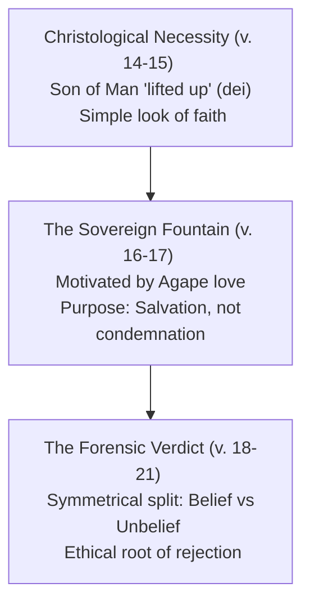

# The Grace and Truth of John 3:16: An Exhaustive Exegetical and Reconstruction Treatise

---

## I. Introduction and Dialogue Context

John 3:16 is historically recognized as the central pivot of the Christian Gospel. Often termed "the Bible in miniature," this single sentence serves as the thematic and theological summation of redemptive history. However, its popularity inside popular culture has occasionally had the unfortunate side effect of obscuring its profound grammatical, historical, and canonical complexities. This treatise aims to restore those depths through rigorous academic exegesis and pastoral synthesis.

The verse is positioned within a larger literary unit: Jesus’ nocturnal discourse with Nicodemus (John 3:1-21). Nicodemus enters the scene as a representative of the first-century Jewish religious establishment—a Pharisee, a ruler of the Jews (seat-holder on the Sanhedrin), and the preeminent "teacher of Israel." The dialogue progresses from a radical deconstruction of human pedigree and moral striving (the necessity of spiritual rebirth from above, vs. 1-8), to the establishment of the Son of Man's unique heavenly revealing authority (vs. 9-13), to the historical execution of the redemptive plan on the cross (vs. 14-15), climaxing in the disclosure of the Father’s sovereign motive and the subsequent dividing line of human destiny (vs. 16-21).

---

## II. Scripture Text Presentation (John 3:14-21)

To locate John 3:16 within its organic literary context, the surrounding passage is presented below in four translations to contrast textual rendering choices:

### John 3:14
* **[NET]** Just as Moses lifted up the serpent in the wilderness, so must the Son of Man be lifted up,
* **[KJV]** And as Moses lifted up the serpent in the wilderness, even so must the Son of man be lifted up:
* **[BSB]** Just as Moses lifted up the snake in the wilderness, so the Son of Man must be lifted up,
* **[CUVS]** 摩西在旷野怎样举蛇，人子也必照样被举起来，

### John 3:15
* **[NET]** so that everyone who believes in him may have eternal life.”
* **[KJV]** That whosoever believeth in him should not perish, but have eternal life.
* **[BSB]** that everyone who believes in Him may have eternal life.
* **[CUVS]** 叫一切信他的都得永生〔注：或译：叫一切信的人在他里面得永生〕。

### John 3:16
* **[NET]** For this is the way God loved the world: He gave his one and only Son, so that everyone who believes in him will not perish but have eternal life.
* **[KJV]** For God so loved the world, that he gave his only begotten Son, that whosoever believeth in him should not perish, but have everlasting life.
* **[BSB]** For God so loved the world that He gave His one and only Son, that everyone who believes in Him shall not perish but have eternal life.
* **[CUVS]** 「上帝爱世人，甚至将他的独生子赐给〔他们〕，叫一切信他的，不致灭亡，反得永生。

### John 3:17
* **[NET]** For God did not send his Son into the world to condemn the world, but that the world should be saved through him.
* **[KJV]** For God sent not his Son into the world to condemn the world; but that the world through him might be saved.
* **[BSB]** For God did not send His Son into the world to condemn the world, but to save the world through Him.
* **[CUVS]** 因为上帝差他的儿子降世，不是要定世人的罪〔注：或译：审判世人；下同〕，乃是要叫世人因他得救。

### John 3:18
* **[NET]** The one who believes in him is not condemned. The one who does not believe has been condemned already, because he has not believed in the name of the one and only Son of God.
* **[KJV]** He that believeth on him is not condemned: but he that believeth not is condemned already, because he hath not believed in the name of the only begotten Son of God.
* **[BSB]** Whoever believes in Him is not condemned, but whoever does not believe has already been condemned, because he has not believed in the name of God’s one and only Son.
* **[CUVS]** 信他的人，不被定罪；不信的人，罪已经定了，因为他不信上帝独生子的名。

### John 3:19
* **[NET]** Now this is the basis for judging: that the light has come into the world and people loved the darkness rather than the light, because their deeds were evil.
* **[KJV]** And this is the condemnation, that light is come into the world, and men loved darkness rather than light, because their deeds were evil.
* **[BSB]** And this is the verdict: The Light has come into the world, but men loved the darkness rather than the Light, because their deeds were evil.
* **[CUVS]** 光来到世间，世人因自己的行为是恶的，不爱光，倒爱黑暗，定他们的罪就是在此。

### John 3:20
* **[NET]** For everyone who does evil deeds hates the light and does not come to the light, so that their deeds will not be exposed.
* **[KJV]** For every one that doeth evil hateth the light, neither cometh to the light, lest his deeds should be reproved.
* **[BSB]** Everyone who does evil hates the Light, and does not come into the Light for fear that his deeds will be exposed.
* **[CUVS]** 凡作恶的便恨光，并不来就光，恐怕他的行为受责备。

### John 3:21
* **[NET]** But the one who practices the truth comes to the light, so that it may be plainly evident that his deeds have been done in God.
* **[KJV]** But he that doeth truth cometh to the light, that his deeds may be made manifest, that they are wrought in God.
* **[BSB]** But whoever practices the truth comes into the Light, so that it may be seen clearly that what he has done has been accomplished in God.”
* **[CUVS]** 但行真理的必来就光，要显明他所行的是靠上帝而行。」

---

## III. Original Language Graphemes and Morphological Detail (John 3:16)

The original Greek text provides several key grammatical signals that illuminate the depth of the passage’s action verbs and conditional clauses:

> **John 3:16 (OHGB)**
> Οὕτως γὰρ ἠγάπησεν ὁ Θεὸς τὸν κόσμον ὥστε τὸν Υἱὸν τὸν μονογενῆ ἔδωκεν ἵνα πᾶς ὁ πιστεύων εἰς αὐτὸν μὴ ἀπόληται ἀλλ᾽ ἔχῃ ζωὴν αἰώνιον

### Detailed Morphological Analysis:

1. **Οὕτως** (*houtōs*): **Adverb**. "In this manner, thus, in this way." Points to the mode or manner of the love, indicating Calvary as its definition.
2. **γὰρ** (*gar*): **Conjunction**. "For, because." Connecting this statement as the theological anchor of verses 14-15.
3. **ἠγάπησεν** (*ēgapēsen*): **Verb, Aorist Active Indicative, 3rd Person Singular** (from *agapaō*). "He loved." The aorist indicative indicates a completed, historic, and definitive past action.
4. **ὁ Θεὸς** (*ho Theos*): **Noun, Nominative Singular Masculine** with the definite article. "God, the Father." The initiating subject of redemption.
5. **τὸν κόσμον** (*ton kosmon*): **Noun, Accusative Singular Masculine** with the definite article (from *kosmos*). "The world." The object of God's love.
6. **ὥστε** (*hōste*): **Conjunction**. "So that, that." Introducing the result or consequence of the preceding clause.
7. **τὸν Υἱὸν τὸν μονογενῆ** (*ton Huion ton monogenē*): **Noun and Adjective, Accusative Singular Masculine** with corresponding articles. "The unique, one-and-only Son." The supreme gift.
8. **ἔδωκεν** (*edōken*): **Verb, Aorist Active Indicative, 3rd Person Singular** (from *didōmi*). "He gave." A coordinate aorist parallel to *ēgapēsen*, establishing the gift as a past historical act (incarnation and crucifixion).
9. **ἵνα** (*hina*): **Conjunction**. "So that, in order that." Introducing a purpose/result clause which requires verbs in the Subjunctive mood.
10. **πᾶς ὁ πιστεύων** (*pas ho pisteuōn*): **Adjective and Noun-Participial, Nominative Singular Masculine** with the definite article (from *pisteuō*). "Everyone believing / who keeps on believing." The **Present tense** participle denotes a continuous, active, ongoing state of trust and self-surrender, contrasting with a one-time intellectual nod.
11. **εἰς αὐτὸν** (*eis auton*): **Preposition and Personal Pronoun, Accusative Singular Masculine**. "Into/in Him." The preposition *eis* marks the target/direction of the trust, indicating an entering into personal union with Jesus Christ.
12. **μὴ ἀπόληται** (*mē apolētai*): **Negative Particle and Verb, Aorist Middle Subjunctive, 3rd Person Singular** (from *apollymi*). "Should not perish / be ruined." The aorist subjunctive with the negative particle *mē* creates a strong barrier, representing the complete cessation of the spiritual ruin trajectory.
13. **ἀλλ᾽** (*all*): **Adversative Conjunction** (from *alla*). "But, on the contrary." Creating a sharp, dualistic antithesis.
14. **ἔχῃ** (*echē*): **Verb, Present Active Subjunctive, 3rd Person Singular** (from *echō*). "Should have, may possess." The **Present tense** subjunctive represents continuous, ongoing, already-started possession of the life.
15. **ζωὴν αἰώνιον** (*zōēn aiōnion*): **Noun and Adjective, Accusative Singular Feminine**. "Eternal, everlasting life." The uncreated divine life of the Kingdom of God.

---

## IV. Exegetical Word Study: Dismantling False Assumptions

Critical exegesis requires a careful retrieval of the historical-lexical definitions of terms that have been subject to subsequent dogmatic distortions.

### 1. *Monogenēs* (μονογενῆ / μονογενής — G3439)
* **The Etymological Truth**:
  For centuries, under the influence of the Latin Vulgate (*unigenitus*), the term *monogenēs* was translated as "only-begotten." During early church disputes, specifically the Arian controversies leading to the Council of Nicaea, this translation was championed to denote Jesus' "eternal generation" from the Father.
  However, modern lexical scholarship (BDAG) has firmly established that *monogenēs* is derived from `μόνος` (*monos* - only, single) and `γένος` (*genos* - kind, class, offspring, race) rather than *gennaō* (to beget).
* **The Semantic Range**:
  Its true semantic range is **"unique, single of its kind, one-and-only."** A prime canonical proof is Hebrews 11:17, where Isaac is called Abraham's *monogenēs*. Isaac was not Abraham's only biological child (Ishmael was born earlier). Rather, Isaac was Abraham's *unique, one-and-only covenant child*.
* **Johannine Weight**:
  In John’s writings (John 1:14, 1:18, 3:16, 3:18; 1 John 4:9), this term defines the ontological status of Christ. Jesus is not a "child of God" by adoption or rebirth, as believers are (*tekna tou Theou*, John 1:12). He is the Son by natural, divine, and absolutely unique essence.

### 2. *Kosmos* (κόσμον / κόσμος — G2889)
* **The Johannine Paradox**:
  While classical Greek and the Septuagint use *kosmos* to describe the created universe or physical earth, the Gospel of John infuses the term with a dark ethical coloring. The *kosmos* represents the systemic structure of humanity **in active, Hostile rebellion** against its Creator (cf. John 1:10, 15:18, 17:14; 1 John 5:19).
* **The Grace Shock**:
  Jesus does not tell Nicodemus that God loved the "righteous," or "Israel," or "repentant souls." He states that God loved the *kosmos* — the very system that hated Him and was actively perishing. The motive of God’s redemptive action is sheer, initiating grace focused on an undeserving, corrupted humanity.

### 3. *Pisteuō* (πιστεύων / πιστεύω — G4100) and *Eis* (εἰς — G1519)
* **Believing "Into"**:
  In Greek literature, believing simply takes the dative case (giving credence or intellectual consent to what someone says). In contrast, John characteristically employs the preposition *eis* ("into"). To believe *eis* Christ is to **rely on, trust in, and commit oneself completely to Him**. It represents an active transference of trust, a casting of one's entire life into union with Christ.
* **The Continuous Present Participle**:
  The participle *ho pisteuōn* is in the present tense. It denotes a continuous state: the one who *keeps on believing*, whose lifestyle is characterized by ongoing dependence upon the Son, is the one possessing eternal life.

### 4. *Apollymi* (ἀπόληται / ἀπόλλυμι — G622)
* **The Trajectory of Ruin**:
  In the middle voice (*apolētai*), the verb represents perishing, being ruined, or lost. In the context of John, "perishing" does not signify annihilation (a total cessation of conscious existence). It represents **gregarious spiritual ruin, active legal condemnation, and exclusion from the life of God** under His abiding wrath (John 3:36), persisting into eternity.

### 5. *Zōē Aiōnios* (ζωὴν αἰώνιον — G2222 + G166)
* **Realized Eschatology**:
  *Zōē* represents life itself (vita qua vivimus, the vital force), contrasting with *bios* (manner/biography of living). *Aiōnios* signifies of the "Age to Come" (*olam haba*). In John’s theology, eternal life is a **realized, present possession** (*echē*). It is the uncreated, supernatural life of God invading the believer's present existence, leading to intimate communion (John 17:3).

---

## V. Historical and Cultural Context: The Sanhedrin's Challenge

To capture the revolutionary impact of John 3:16, one must reconstruct the socio-political and theological atmosphere of first-century Second Temple Judaism:

1. **Ethnic Exclusivity and Messianic Wrath**:
   Under the oppressive boot of the Roman Empire, local Jewish expectations (particularly among Pharisees and sectarian movements like the Qumran community) had grown highly nationalistic. It was widely believed that when the Messiah arrived, His primary mission toward the Gentiles (the *kosmos*) would be one of **wrath, conquest, and destruction** (e.g., *IV Ezra*, *The War Scroll*). Salvation was viewed as an exclusive birthright of ethnic Israel.
2. **The Dismantling of Nicodemus' Assumptions**:
   Nicodemus visits Jesus representing the Sanhedrin—the body responsible for maintaining this national-religious boundary. When Jesus tells him, *"Unless one is born again [from above], he cannot see the kingdom of God"* (John 3:3) and that *"God so loved the world [the whole kosmos, Gentiles included]"*, He completely devastates Pharisaical pride. Jesus replaces ethnic lineage with spiritual regeneration, and nationalistic wrath with a universal, grace-filled offer of salvation to *whoever* believes.

---

## VI. Typological Precedent: The Wilderness Remedy

Jesus explains the mechanics of His saving mission by resurrecting an iconic, albeit bizarre, event from Israel's wilderness wanderings:

* **The Numbers 21:4-9 Backdrop**:
  Because of Israel's rebellion, Yahweh sent venomous, "fiery serpents" among the people. Many died. When the people repented, God commanded Moses to mold a bronze serpent, mount it on a standard pole, and declare that whoever was bitten had only to **look** at the bronze serpent to find healing.
* **The Exegetical Correlations**:
  1. **The Serpent Likeness**: The bronze serpent was made in the precise visual likeness of the venomous killers, yet without their actual poison. Symmetrically, the Son of Man was sent *"in the likeness of sinful flesh"* (Romans 8:3), taking the form of a man to bear the curse of sin, yet Himself completely pure.
  2. **The Lifting Up (*Hypsōthēnai*)**: The Greek verb contains a double meaning characteristic of John's literary style: physical suspension on the Roman cross, and spiritual exaltation/glorification.
  3. **The Bare Look of Faith**: The dying Israelite did not perform works, administer remedies, or complete self-purification. They simply directed an ongoing look of trust at the pole, and lived. This is the exact mechanism of saving faith: look and live!

---

## VII. Logical Thought Progression and Symmetrical Outline

The discourse of John 3:14-21 is structured with high literary precision, progressing from Christological necessity to a binary verdict of judgment:



### Detailed Structural Exposition:

1. **The Christological Precedent: Typology of Exaltation (John 3:14-15)**
   * **v. 14a**: The wilderness precedent of Moses lifting up the bronze serpent.
   * **v. 14b**: The divine necessity (*dei*) of the Son of Man’s elevation (crucifixion/exaltation).
   * **v. 15**: The universal condition of faith (*pisteuōn*) and result (possession of *zōēn aiōnion*).
2. **The Fountain of Divine Grace: God's Initiating Love (John 3:16-17)**
   * **v. 16a**: The supreme motive (*Oūtos ēgapēsen* - "In this manner He loved") directed at the rebel *kosmos*.
   * **v. 16b**: The supreme cost: giving (*edōken*) His unique Son (*ton μονογενῆ*).
   * **v. 16c**: The dual design: rescue (*mē apolētai* - not perish) and gift (*echē zōēn aiōnion* - have eternal life).
   * **v. 17**: The corrective statement redefining mission intent: sent not for condemnation (*krīnē*) but salvific rescue (*sōthē*).
3. **The Forensic Verdict: Symmetrical Divide (John 3:18-21)**
   * **v. 18**: The immediate binary split. The believer is exempt from condemnation (*ou krīnetai*); the unbeliever exists under a completed state of condemnation (*ēdē kekrītai*) because of their rejection of the unique Son.
   * **v. 19**: The criteria of the verdict: Light (*to phōs*) has invaded the world, but humans loved darkness (*to skotos*) because of wicked lifestyles (*ponēra*).
   * **v. 20**: The pathology of rebellion: practitioners of evil hate the light and flee exposure of their deeds (*elenchthē*).
   * **v. 21**: The evidence of regeneration: practitioners of truth move toward the light, manifesting that their live actions are supernaturally wrought in God (*en Theō eirgasmena*).

---

## VIII. Doctrinal and Theological Integration

John 3:16 serves as the master junction of Christian systematic theology, weaving five major doctrines into a coherent redemptive tapestry:

1. **Soteriology (Doctrine of Salvation)**:
   Salvation is shown to be a work of pure grace (*sola gratia*), completely independent of human moral performance, pedigree, or legal works. It is received solely through the instrument of personal faith (*sola fide*) in the substitute (*solus Christus*).
2. **Christology (Doctrine of Christ)**:
   Asserts both His absolute, unique deity (*monogenēs* - sharing the Father’s uncreated essence) and His saving mission as the historical Substitute lifted up on the cross to bear human sin.
3. **Theology Proper (Doctrine of God)**:
   Reveals the Father not as a distant, indifferent deity, but as the initiating source of redemption. His character is defined by a self-sacrificial, active love (*agape*) that willingly bears the ultimate cost—the death of His Son—to achieve rescue.
4. **Hamartiology (Doctrine of Sin)**:
   Human sin is treated with tragic seriousness. The *kosmos* is presented as corrupted, dying, and already under a heavy trajectory of perishing under active legal condemnation and Holy wrath.
5. **Eschatology (Doctrine of Final Things)**:
   Exhibits "Realized Eschatology," where the uncreated, resurrection life of the "Age to Come" (*zōē aiōnios*) is brought into the present evil age as an already-possessed reality for the believer.

---

## IX. Canonical Redemptive Fit: The Great Narrative Thread

The message of John 3:16 is not an isolated NT novelty, but the fulfillment of a monumental grand narrative running across the canon:

```mermaid
chronology
    title Symmetrical Redemptive Chronology of John 3:16
    Genesis 22 : The Akedah -- Abraham willing to sacrifice Isaac his unique beloved son
    Numbers 21 : The Wilderness Remedy -- Bronze serpent lifted up on a pole for look-and-live rescue
    Isaiah 53 : The Suffering Servant -- Yahweh handing over the Servant as a substitutionary sacrifice
    John 3:16 : Calvary Fulfillment -- Father giving His unique Son as the ultimate substitutionary sacrifice
    Romans 5:8 : Demonstration of Love -- God showing His love in that Christ died while we were sinners
    1 John 4:9-10 : Love defined as Propitiation -- Father sending His Son to be the atoning sacrifice
    Revelation 2:7 : Consummated Restoration -- The tree and water of life possessed permanently in glory
```

* **The Symmetrical Correlation between Abraham and the Father (Genesis 22)**:
  In the Akedah, Abraham is commanded to take his *monogenēs* (unique covenant son Isaac) whom he loves, and offer him on Mount Moriah. Because Abraham did not withhold his beloved son, he receives God’s highest commendation. In John 3:16, God the Father does what Abraham did not have to carry out: He "did not spare His own Son, but gave Him up for us all" (Romans 8:32).
* **The Substitutionary Servant (Isaiah 53)**:
  John's "giving" of the Son echoes Isaiah 53’s Servant of Yahweh who is "pierced for our transgressions" and "crushed for our iniquities" (Isaiah 53:5).
* **Apostolic Expansion**:
  The Apostle Paul echoes John 3:16 in Romans 5:8 (*"God demonstrates His own love... while we were still sinners..."*), and John expands on the sacrificial mechanism in 1 John 4:10, defining the "giving" of the Son as the ultimate *hilasmos* (propitiation/atoning sacrifice) that placates Holy wrath.

---

## X. Literary Style and Rhetorical Analysis

The Gospel of John is famous for its simple, yet elevated and solemn literary style:

1. **The Classical Adverb *Houtōs***:
   As analyzed in the grammatical section, *Oūtos* primarily denotes "in this way" or "in this manner." This represents a profound rhetorical device. Jesus does not say God loved the world "so much" (measuring the intensity of an emotion), but rather **"God loved the world in this manner: He gave His Son..."** The love is defined, dramatized, and validated by the physical, legal action of Calvary.
2. **"Climbing Prose" and Parallelism**:
   John's prose exhibits a staircase-like parallelism, where concepts build sequentially:
   * **God** (The Source)
   * **Loved** (The Motive)
   * **The World** (The Object)
   * **Gave His Son** (The Costly Action)
   * **Whoever Believes** (The Universal Invitation)
   * **Not Perish** (The Rescue)
   * **Have Life** (The Final Possession)
   This rhythmic, repetitive structure makes the text highly memorable, liturgical, and monumental.

---

## XI. Homiletical Development: "The Seven Wonders of John 3:16"

This outline provides a structured, warm, and highly persuasive sermonic flow designed for pastoral preaching:

### Headline: The Climax of Heavenly Love

* **WONDER 1: The Almighty Source — "God"**
  * *Exposition*: The self-existent, sovereign Creator of the universe.
  * *Illustration*: A king stepping off his throne to pardon a rebel.
* **WONDER 2: The Mightiest Motive — "So loved"**
  * *Exposition*: Love demonstrated not by emotion, but by Calvary's mode.
  * *Illustration*: A father standing in the line of execution to shield his child.
* **WONDER 3: The Broken Barrier — "The world"**
  * *Exposition*: The rebellious, hostile humanity (*kosmos*) that rejected Him.
  * *Illustration*: Extending amnesty to enemy combatants mid-battle.
* **WONDER 4: The Greatest Gift — "That He gave His unique Son"**
  * *Exposition*: The infinite cost of giving His *monogenēs*.
  * *Illustration*: A sacrifice that cannot be quantified in earthly silver or gold.
* **WONDER 5: The Widest Welcome — "That whoever"**
  * *Exposition*: Dismantling ethnic, economic, and moral barriers.
  * *Illustration*: An open invitation with no qualifications listed.
* **WONDER 6: The Perfect Pivot — "Believes in Him"**
  * *Exposition*: Faith as personal vital reliance (*pisteuō eis*), not just head assent.
  * *Illustration*: Stepping onto a bridge, trusting it completely to bear your weight.
* **WONDER 7: The Grand Rescue — "Should not perish, but have eternal life"**
  * *Exposition*: Arresting the trajectory of spiritual ruin; beginning the qualitatve life of the Age to Come in the present.
  * *Illustration*: A drowning man being yanked from the depths and restored to abundant health.

---

## XII. Spiritual and Practical Life Guides

To bridge the gap between academic exegesis and daily lifestyle, the following practical protocols are established:

### 1. The Protocol of Daily Surrender (Individual Lifestyle)
* **Objective**: Transition from a past "decision" of faith to daily vital dependence on Jesus (*pisteuō eis*).
* **The Practice**: Each morning, spent 2 minutes in silent dedication. Pray: *"Lord, I do not stand on my moral efforts, works, or clean record today. I throw the full weight of my life into the finished work of Jesus Christ. I live today in union with Him."*

### 2. The Protocol of Transparency (Spiritual Discipline)
* **Objective**: Overcome the "love of darkness" by walking strictly in the light (John 3:20-21).
* **The Practice**: Maintain an active, weekly accountability relationship with a mature brother or sister in Christ. Give them permission to examine your blindspots. Confess any hidden compromises, bringing them out of the shadows of secrecy into the therapeutic, cleansing light of fellowship (1 John 1:7).

### 3. The Protocol of Barrier-Breaking Love (Corporate Community & Mission)
* **Objective**: Align church life and personal relationships with God's reaching love for the *kosmos* (Gentiles included).
* **The Practice**: Actively reach out to, welcome, and serve individuals in your neighborhood or community who are socially, culturally, or politically segregated from you. Intentionally build friendships with the marginalized, demonstrating that God's covenant table is open to all.

---

## XIII. Pastoral Scriptural Prayer (First-Person Devotion)

This prayer is formulated to allow the individual to pray these truths directly in response to John 3:16:

> O Heavenly Father, Lord of heaven and earth,
>
> I stand before You with a heart bowed in utter wonder and gratitude. When I contemplate the vastness of Your holiness, I am overwhelmed that You, the Almighty Creator, should ever look upon me. Yet, Your Word assures me, and my soul trusts to believe, that **You so loved the world – that You so loved me.**
>
> I confess, O Lord, that I have lived as a citizen of a rebellious world. I have known times of dark compromise; I have walked paths of self-will; I have done deeds that would shrink from the glare of Your light. Left to myself, I am in a perishing state, infected with the poison of sin and already under condemnation. I have no works, no moral pedigree, and no goodness of my own to plead.
>
> But today, Father, I look to the cross. I gaze upon Jesus Christ, Your unique, beloved, one-and-only Son, whom You did not spare but willingly handed over for me. Lord Jesus, thank You that You allowed Yourself to be "lifted up" on that Roman cross, bearing my shame, my guilt, my curse, and the holy judgment that I deserved.
>
> Right now, I step out from the shadows of secrecy and run to Your light of truth. I transfer my trust away from my own performance and cast the entire weight of my soul **into You, Lord Jesus.** I believe *into* You. I surrender my life, my future, my fears, and my failures into Your hands. I rely completely upon Your finished work on Calvary.
>
> Thank You, Father, that because I believe on the name of Your unique Son, the sentence of active condemnation is cancelled. Thank You that I shall not perish! Thank You that You have granted me **eternal, uncreated life** starting at this very moment.
>
> Speak to me, Holy Spirit, and teach me how to live this divine life day-by-day. Empower my feet to walk in absolute transparency, my hands to serve a broken world, and my mouth to proclaim Your reaching love.
>
> In the precious, holy, and matchless name of Your unique Son, Jesus Christ,
>
> Amen.

---

## XIV. Interactive Small Group Study Guide

These discussion prompts are engineered to guide groups into deep, communal exploration of John 3:14-21:

1. **Familiarity vs. Depth**: John 3:16 is arguably the most famous verse in the entire Bible. How has your familiarity with it affected how you read it? What specific insight from today's study challenged or enlarged your previous understanding of this verse?
2. **The "World" Concept**: In John's writings, the "world" (*kosmos*) is not a neutral or beautiful physical planet, but a system of humanity in hostile rebellion against God. How does it change your view of God's love to realize He loves His enemies? How does that affect how we are called to love those who oppose us?
3. **Moses' Snake Typology**: Read Numbers 21:4-9. What are the specific visual and theological parallels between Moses lifting the bronze snake on a pole and Jesus being lifted up on the cross? Why is "looking" such a perfect metaphor for saving faith?
4. **Linguistic Refinements**: The Greek word *monogenēs* means "unique, one-and-only" (as in Isaac's relation to Abraham) rather than "only-begotten." And *Oūtos* means "in this way" rather than "so much." How do these two linguistic adjustments help clarify Jesus' identity and how God demonstrates His love?
5. **Fleeing the Light**: In John 3:19-20, Jesus notes that men hate the light and flee to the darkness because their deeds are evil. Why is vulnerability and transparency so painful for us? What practical step can our small group take to make our community a safe place for people to step out of the dark and into the light?
6. **Realized Life**: How does realizing that "eternal life" is a present, qualitative possession (communion with God now) rather than just a future ticket to heaven change how you live your daily life?

---

## XV. Conclusion and Synthesis Summary

John 3:16 remains the ultimate, non-negotiable anchor of the Christian confession. Through rigorous exegesis, we discover that its coordinates are perfectly balanced: it originates in the initiating, sovereign *agape* love of God the Father; it is executed in the historical, painful, and glorifying oblation of His unique (*monogenēs*) Son on Calvary; it is applied through a continuous, vital trust (*pisteuō eis*) of self-surrender; and it results in the absolute cancellation of perishing and the immediate possession of the uncreated, eternal life of the Age to Come.

Whenever the church proclaims this verse, she is not merely repeating a comforting sentiment; she is declaring a cosmic amnesty, a radical demolition of religious boundaries, and a forensic verdict of light and life to a perishing world. Let us hold fast to these coordinates, preaching them with academic precision and practicing them with pastoral zeal.
